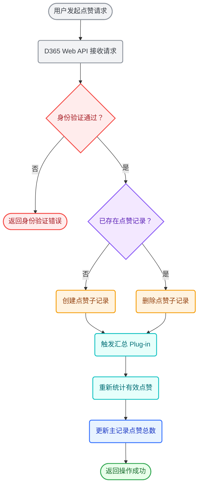

# Complete Example: D365 Likes Aggregation

This example derives seven classes from the business content instead of assigning fixed colors to generic shape roles.

Legend: Gray = request entry; red = authentication and authentication error; purple = current like state; orange = child-record changes; cyan = plug-in aggregation; blue = master-record update; green = successful outcome.
