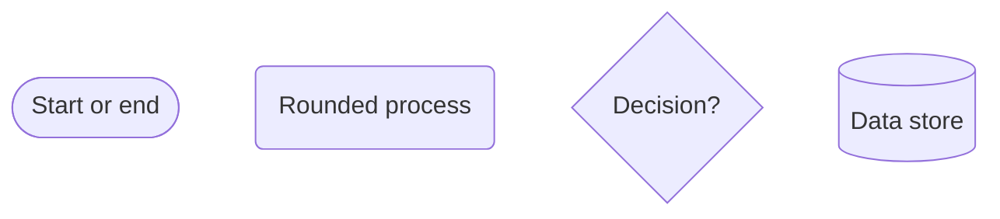

# Visual Style Reference

Use this reference for every generated flowchart. The palette families are reusable, but their semantic meanings are assigned dynamically from each diagram's content; no color has a permanent business meaning.

## Diagram Type Boundary

- Apply this reference only to `flowchart TD` and `flowchart LR`, including architecture and relationship diagrams represented with flowchart nodes, edges, decisions, and subgraphs.
- The required `classDef` declarations and `class` assignments are a flowchart styling contract. They are not portable styling syntax for every Mermaid diagram type.
- Treat `sequenceDiagram`, `classDiagram`, `erDiagram`, `stateDiagram`, and other non-flowchart grammars as out of scope. Never insert flowchart `classDef` or `class` directives into them.
- If this skill is invoked for an explicit non-flowchart request, briefly explain the boundary and ask whether to remodel the content as a flowchart before generating anything.

## Approved Palette

| Family | Fill | Stroke | Text |
|---|---|---|---|
| Blue | `#E8F3FF` | `#3370FF` | `#1D39C4` |
| Purple | `#F3E8FF` | `#8B5CF6` | `#5B21B6` |
| Cyan | `#E6FFFB` | `#13C2C2` | `#006D75` |
| Green | `#E8FFEA` | `#34A853` | `#176B2C` |
| Orange | `#FFF3E0` | `#F59E0B` | `#92400E` |
| Red | `#FFECEC` | `#F54A45` | `#A61D24` |
| Gray | `#F2F3F5` | `#8F959E` | `#373C43` |

Every `classDef` must include `fill`, `stroke`, `stroke-width`, and `color`. Use `1.5px` or `2px` consistently. Canonical form:

```mermaid
classDef categoryName fill:#E8F3FF,stroke:#3370FF,stroke-width:2px,color:#1D39C4
```

Avoid saturated solid fills and unrelated high-chroma borders. Category distinction should come from the soft fill, restrained same-family stroke, text label, and shape together.

## Renderer-Safe Shapes

Prefer established flowchart syntax:



- Use unique ASCII identifiers; put user-facing text in quoted labels when it contains spaces, punctuation, or non-ASCII characters.
- Prefer rounded nodes for processes, diamonds for decisions, cylinders for data stores, and stadium-shaped nodes for starts or terminal outcomes.
- Keep labels to one line when possible and no more than two short lines.
- Avoid HTML labels, external icons, experimental syntax, and assumptions about custom renderer configuration.

## Direction and Density

- Default process diagrams to `flowchart TD` for a clear top-to-bottom main path.
- Use `flowchart LR` when the principal path is short and linear or when a compact architecture reads more naturally left to right.
- Never place more than five principal nodes in one horizontal row. Switch to `TD`, wrap through subgraphs, or split the diagram when the row would be wider.
- Check likely crossings and keep the primary route as direct as possible.

## Semantic Classes

- Derive three to seven categories from the content, then name classes with short lowercase ASCII identifiers such as `identity`, `approval`, `records`, or `sync`.
- Do not default to generic visual roles such as `action1`, `blue`, or `startEnd` when a domain category is available.
- Assign each styled node to exactly one semantic class and apply the same class everywhere that category recurs.
- Keep category meaning visible in labels, shapes, subgraphs, or the legend so color is never the only signal.

## Edges

- Use thin neutral connectors for ordinary flow and explicit text for every decision outcome, such as `是`/`否` or domain-specific results.
- Emphasize only an important success, exception, or critical path. Use a darker same-family stroke or a restrained dashed secondary edge rather than multiple saturated colors.
- In multi-loop architectures, visually prioritize the main path and distinguish secondary, callback, or asynchronous routes with labels and restrained dashed edges.
- Keep edge labels short and place details in node text when that reduces clutter.

## Subgraphs

- Use `subgraph` only for real system boundaries, modules, stages, or ownership groups.
- Give every subgraph a meaningful user-facing title and keep the main path easy to follow across boundaries.
- Do not add decorative containers or give every individual node its own subgraph.
- If styling a subgraph, use a very pale neutral fill and quiet border so it does not compete with semantic node classes.
