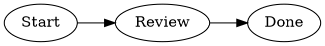
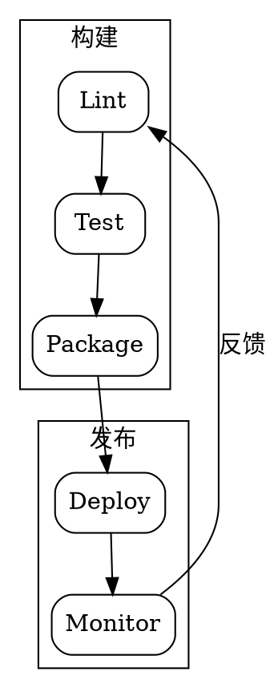

# DOT Graphviz 预览支持 Implementation Plan

> **For agentic workers:** REQUIRED SUB-SKILL: Use superpowers:subagent-driven-development (recommended) or superpowers:executing-plans to implement this plan task-by-task. Steps use checkbox (`- [ ]`) syntax for tracking.

**Goal:** 为 Markdown 中的 `dot`、`graphviz`、`gv` 围栏代码块增加本地 Graphviz SVG 预览，并让浏览器扩展与 VS Code Webview 共用同一套图表体验。

**Architecture:** 使用 `@viz-js/viz` 动态加载 Graphviz WASM，封装为带有限缓存的 `renderDot` 核心模块；新增 `DotBlock` 接入现有代码块管线。将 Mermaid 全屏预览抽象为中性的图表预览组件，DOT 使用独立 SVG 清洗入口，避免复用 Mermaid 的边界扩展逻辑。

**Tech Stack:** React 18、TypeScript、Vite/CRXJS、Vitest、Playwright、DOMPurify、`@viz-js/viz`。

**Spec:** `docs/superpowers/specs/2026-09-03-dot-graphviz-preview-design.md`

## Global Constraints

- 第一版只支持 `dot`、`graphviz`、`gv` 代码块的静态预览，不提供 DOT 源码编辑器。
- 渲染必须在本地完成，不调用外部 Graphviz 服务。
- Mermaid、普通代码、表格、目录及现有预览交互必须保持兼容。
- DOT 不执行 Mermaid 的 SVG 边界扩展；Graphviz 的 `viewBox`、节点位置和尺寸必须保持原始结果。
- 原始 SVG 不得直接注入页面；所有输出必须经过 DOT 专用清洗。
- 浏览器扩展和 VS Code Webview 使用同一份 React 渲染实现，并验证 WASM 资源随构建产物输出。
- 所有新增代码和 Markdown 文档使用简体中文注释、文案和说明。

---

### Task 1: 添加 Graphviz 依赖并实现 DOT 渲染核心

**Files:**
- Modify: `package.json`（在 dependencies 中加入 `@viz-js/viz`）
- Modify: `pnpm-lock.yaml`（项目实际锁文件，执行包管理器安装后同步）
- Create: `src/lib/dot-init.ts`
- Test: `tests/unit/dot-init.test.ts`

**Interfaces:**
- Consumes: DOT 源码字符串，以及可选 Graphviz 引擎名（第一版固定为 `dot`）。
- Produces: `renderDot(code: string, engine?: 'dot'): Promise<string>`，成功返回 SVG 字符串，失败抛出带用户可读信息的 `Error`。

- [ ] **Step 1: 写失败测试，锁定渲染和缓存接口**

在 `tests/unit/dot-init.test.ts` 中 mock `@viz-js/viz`，覆盖异步实例、SVG 输出和缓存：

```ts
const mockRenderString = vi.fn();
const mockInstance = vi.fn().mockResolvedValue({ renderString: mockRenderString });

vi.mock('@viz-js/viz', () => ({ instance: mockInstance }));

it('使用 dot 引擎把源码渲染成 SVG', async () => {
  mockRenderString.mockReturnValue('<svg><g id="graph0" /></svg>');
  const { renderDot } = await import('@/lib/dot-init');

  await expect(renderDot('digraph G { A -> B; }')).resolves.toContain('<svg>');
  expect(mockInstance).toHaveBeenCalledTimes(1);
  expect(mockRenderString).toHaveBeenCalledWith('digraph G { A -> B; }', {
    format: 'svg',
    engine: 'dot',
  });
});

it('相同源码命中缓存，不重复初始化和渲染', async () => {
  mockRenderString.mockReturnValue('<svg />');
  const { renderDot } = await import('@/lib/dot-init');

  await renderDot('graph G { A -- B; }');
  await renderDot('graph G { A -- B; }');

  expect(mockInstance).toHaveBeenCalledTimes(1);
  expect(mockRenderString).toHaveBeenCalledTimes(1);
});
```

- [ ] **Step 2: 运行测试，确认当前失败**

运行：`npm test -- --run tests/unit/dot-init.test.ts`

预期：FAIL，提示 `@viz-js/viz` 或 `renderDot` 尚未实现。

- [ ] **Step 3: 安装依赖并实现最小渲染器**

执行 `pnpm add @viz-js/viz`，然后在 `src/lib/dot-init.ts` 实现动态加载 Promise、实例缓存、有限 LRU SVG 缓存和错误包装：

```ts
type DotEngine = 'dot';
type VizInstance = {
  renderString: (code: string, options: { format: 'svg'; engine: DotEngine }) => string;
};
let instancePromise: Promise<VizInstance> | null = null;
const svgCache = new Map<string, string>();

function loadViz(): Promise<VizInstance> {
  if (!instancePromise) {
    instancePromise = import('@viz-js/viz').then(({ instance }) => instance());
  }
  return instancePromise;
}

export async function renderDot(code: string, engine: DotEngine = 'dot'): Promise<string> {
  const key = `${engine}\0${code}`;
  const cached = svgCache.get(key);
  if (cached) return cached;

  try {
    const viz = await loadViz();
    const svg = viz.renderString(code, { format: 'svg', engine });
    if (!svg.trim().startsWith('<svg')) {
      throw new Error('Graphviz 未返回有效 SVG');
    }
    svgCache.set(key, svg);
    return svg;
  } catch (error) {
    const message = error instanceof Error ? error.message : String(error);
    throw new Error(message || 'DOT 渲染失败');
  }
}
```

实现时将缓存限制为源码与 SVG 总字节数不超过 2 MiB，并在超过上限时删除最旧条目；不要把 `instance()` 放在每次渲染函数内部。

- [ ] **Step 4: 运行测试，确认通过**

运行：`npm test -- --run tests/unit/dot-init.test.ts`

预期：所有 DOT 核心测试 PASS；缓存测试确认实例和渲染函数只调用一次。

- [ ] **Step 5: 提交任务 1**

```bash
git add package.json pnpm-lock.yaml src/lib/dot-init.ts tests/unit/dot-init.test.ts
git commit -m "feat: 添加 Graphviz DOT 渲染核心"
```

### Task 2: 实现 DOT SVG 安全清洗

**Files:**
- Create: `src/viewer/utils/sanitize-dot-svg.ts`
- Modify: `src/viewer/utils/sanitize-svg.ts`（仅提取可复用的低层清洗逻辑时修改，保持 Mermaid 导出接口兼容）
- Test: `tests/unit/sanitize-dot-svg.test.ts`

**Interfaces:**
- Consumes: Graphviz 输出的原始 SVG 字符串。
- Produces: `sanitizeDotSvg(svg: string): string`，返回可安全插入页面的 SVG；非法或非 SVG 输入返回空字符串或抛出明确错误，由 `DotBlock` 负责降级。

- [ ] **Step 1: 写失败测试，覆盖危险内容和合法 Graphviz 结构**

```ts
it('保留 Graphviz 节点、边和文字', () => {
  const svg = '<svg><g class="node"><title>A</title><text>A</text></g><path d="M0 0" /></svg>';
  expect(sanitizeDotSvg(svg)).toContain('<text>A</text>');
});

it('移除脚本、事件属性和 javascript 链接', () => {
  const svg = '<svg><script>alert(1)</script><a href="javascript:alert(1)" onclick="alert(1)"><text>X</text></a></svg>';
  const result = sanitizeDotSvg(svg);
  expect(result).not.toMatch(/script|onclick|javascript:/i);
  expect(result).toContain('<text>X</text>');
});
```

- [ ] **Step 2: 运行测试确认失败**

运行：`npm test -- --run tests/unit/sanitize-dot-svg.test.ts`

预期：FAIL，提示清洗函数不存在或危险节点仍存在。

- [ ] **Step 3: 实现 DOT 专用清洗函数**

使用 DOMPurify 的 SVG profile，允许 Graphviz 常用的 `svg`、`g`、`path`、`polygon`、`ellipse`、`text`、`title`、`defs`、`marker` 等元素；删除脚本、事件属性、外部 CSS 和危险协议。不要调用 `expandMermaidSvgBounds` 或 Mermaid 文本主题注入：

```ts
export function sanitizeDotSvg(svg: string): string {
  const sanitized = DOMPurify.sanitize(svg, {
    USE_PROFILES: { svg: true, svgFilters: true },
    ADD_TAGS: ['title', 'desc', 'marker', 'polygon', 'ellipse', 'path', 'text', 'tspan'],
    ADD_ATTR: ['viewBox', 'fill', 'stroke', 'stroke-width', 'marker-end', 'font-family', 'font-size'],
    FORBID_TAGS: ['script', 'foreignObject', 'style'],
    FORBID_ATTR: ['onerror', 'onclick', 'onload'],
  });
  return sanitized.trim().startsWith('<svg') ? sanitized : '';
}
```

实际实现必须用 DOMPurify 的 URL 协议配置拒绝 `javascript:`，并通过测试确认 `href`、`xlink:href` 的处理结果。

- [ ] **Step 4: 运行测试确认通过**

运行：`npm test -- --run tests/unit/sanitize-dot-svg.test.ts tests/unit/sanitization.test.ts tests/unit/xss-prevention.test.ts`

预期：DOT 新测试和既有安全测试全部 PASS，Mermaid 清洗行为不变。

- [ ] **Step 5: 提交任务 2**

```bash
git add src/viewer/utils/sanitize-dot-svg.ts src/viewer/utils/sanitize-svg.ts tests/unit/sanitize-dot-svg.test.ts
git commit -m "feat: 增加 DOT SVG 安全清洗"
```

### Task 3: 抽象通用图表预览与导出交互

**Files:**
- Create: `src/viewer/components/Diagram/DiagramPreviewModal.tsx`
- Create: `src/viewer/components/Diagram/DiagramToolbar.tsx`
- Modify: `src/viewer/components/Mermaid/MermaidToolbar.tsx`
- Modify: `src/viewer/components/Mermaid/MermaidPreviewModal.tsx`（迁移到通用组件或保留兼容包装）
- Modify: `src/viewer/styles/mermaid.css`
- Modify: `src/viewer/styles/print.css`
- Test: `tests/unit/diagram-preview.test.tsx`
- Test: `tests/unit/mermaid-preview-only.test.tsx`（保留现有 Mermaid 回归断言）

**Interfaces:**
- Consumes: 已清洗的 SVG、源码字符串、图表类型和块索引。
- Produces: `DiagramToolbar({ code, svgSelector, blockIndex, kind, children })` 和 `DiagramPreviewModal({ svg, onClose, title })`；MermaidToolbar 通过兼容包装继续导出现有组件接口。

- [ ] **Step 1: 写失败测试，锁定通用文案和交互**

```tsx
it('DOT 工具栏使用图表文案并能打开预览', async () => {
  render(
    <DiagramToolbar code="digraph G {}" blockIndex={0} kind="DOT" svgSelector=".feishu-dot svg">
      <div className="feishu-dot"><svg /></div>
    </DiagramToolbar>,
  );

  expect(screen.getByRole('button', { name: '预览 DOT 图表' })).toBeInTheDocument();
  await userEvent.click(screen.getByRole('button', { name: '预览 DOT 图表' }));
  expect(screen.getByRole('dialog', { name: 'DOT 图表预览' })).toBeInTheDocument();
  expect(screen.getByRole('button', { name: '× 退出' })).toBeInTheDocument();
});
```

- [ ] **Step 2: 运行测试确认失败**

运行：`npm test -- --run tests/unit/diagram-preview.test.tsx`

预期：FAIL，通用组件和 DOT 文案尚未存在。

- [ ] **Step 3: 提取通用预览能力并保持 Mermaid 兼容**

从现有 `MermaidPreviewModal` 迁移以下逻辑到 `DiagramPreviewModal`：SVG 尺寸解析、适应画布、缩放、滚动同步、空格键平移、抓手拖拽、工具栏自动显隐、退出后焦点恢复。组件接口使用中性标题：

```ts
interface DiagramPreviewModalProps {
  svg: string;
  title: string;
  onClose: () => void;
}
```

通用组件必须保留现有行为：滚轮滚动画布、不触发缩放；全屏画布直接铺开；左上角退出按钮为圆角矩形；不重复创建蒙版。

在 `DiagramToolbar` 中抽取复制、SVG 导出和 PNG 导出，文件名前缀由 `kind.toLowerCase()` 生成，例如 `dot-diagram-0.svg`。通过 `svgSelector` 找到正文中已渲染的 SVG，未找到时禁用预览和导出操作。

- [ ] **Step 4: 运行通用和 Mermaid 回归测试**

运行：`npm test -- --run tests/unit/diagram-preview.test.tsx tests/unit/mermaid-preview-only.test.tsx tests/unit/export-mermaid.test.ts`

预期：DOT 通用交互测试 PASS，Mermaid 预览、导出和无编辑入口的既有断言全部 PASS。

- [ ] **Step 5: 提交任务 3**

```bash
git add src/viewer/components/Diagram src/viewer/components/Mermaid src/viewer/styles/mermaid.css src/viewer/styles/print.css tests/unit/diagram-preview.test.tsx tests/unit/mermaid-preview-only.test.tsx
git commit -m "refactor: 抽取通用图表预览交互"
```

### Task 4: 接入 DotBlock 和 Markdown 代码块分支

**Files:**
- Create: `src/viewer/components/Markdown/DotBlock.tsx`
- Modify: `src/viewer/components/Markdown/CodeBlock/CodeBlock.tsx`
- Modify: `src/viewer/components/Markdown/FeishuComponents.tsx`（如需注册组件，保持现有 rehype-react 映射）
- Modify: `src/viewer/styles/feishu-theme.css`
- Modify: `src/viewer/styles/dark-theme.css`
- Test: `tests/unit/dot-block.test.tsx`
- Test: `tests/unit/markdown-pipeline.test.ts`

**Interfaces:**
- Consumes: `code: string`、`index: number`，以及 `renderDot`、`sanitizeDotSvg`、`DiagramToolbar`。
- Produces: 正文中的 `.feishu-dot` 图表节点；加载失败时输出 `.feishu-dot__error` 和源码降级块。

- [ ] **Step 1: 写失败测试，覆盖语言别名、成功态和错误态**

```tsx
vi.mock('@/lib/dot-init', () => ({
  renderDot: vi.fn().mockResolvedValue('<svg><text>DOT</text></svg>'),
}));

it.each(['dot', 'graphviz', 'gv'])('语言 %s 渲染为 DOT 图表', async (language) => {
  const view = render(<FeishuCodeBlock>{<code className={`language-${language}`}>digraph G {}</code>}</FeishuCodeBlock>);
  expect(await view.findByText('DOT')).toBeInTheDocument();
  expect(view.container.querySelector('.feishu-dot')).toBeTruthy();
});

it('DOT 失败时保留源码并显示错误', async () => {
  vi.mocked(renderDot).mockRejectedValueOnce(new Error('syntax error'));
  const view = render(<DotBlock code="digraph {" index={0} />);
  expect(await view.findByText('DOT 渲染失败')).toBeInTheDocument();
  expect(view.container.querySelector('pre')).toHaveTextContent('digraph {');
});
```

- [ ] **Step 2: 运行测试确认失败**

运行：`npm test -- --run tests/unit/dot-block.test.tsx`

预期：FAIL，DOT 分支和组件尚未实现。

- [ ] **Step 3: 实现 DotBlock 的异步懒渲染**

参考 `MermaidBlock` 的 IntersectionObserver 模式，但调用 DOT 渲染和 DOT 清洗：

```tsx
export function DotBlock({ code, index }: { code: string; index: number }) {
  const [svg, setSvg] = useState<string | null>(null);
  const [error, setError] = useState<Error | null>(null);

  useEffect(() => {
    let cancelled = false;
    void renderDot(code).then((rawSvg) => {
      if (cancelled) return;
      const safeSvg = sanitizeDotSvg(rawSvg);
      if (!safeSvg) throw new Error('DOT SVG 安全处理失败');
      setSvg(safeSvg);
    }).catch((cause) => {
      if (!cancelled) setError(cause instanceof Error ? cause : new Error(String(cause)));
    });
    return () => { cancelled = true; };
  }, [code]);

  if (error) return <DotErrorFallback code={code} message={error.message} />;
  if (!svg) return <div className="feishu-dot feishu-dot--loading">正在生成 DOT 图表…</div>;
  return <DiagramToolbar kind="DOT" code={code} blockIndex={index} svgSelector=".feishu-dot svg"><div className="feishu-dot" dangerouslySetInnerHTML={{ __html: svg }} /></DiagramToolbar>;
}
```

实际实现应补上 IntersectionObserver、卸载取消和 `aria-live` 加载/错误文案；错误 fallback 不得让异常继续冒泡到 Markdown 根组件。

- [ ] **Step 4: 接入 CodeBlock 语言识别并加入 DOT 样式**

将语言提取规范化为小写并去除 `language-` 前缀：

```ts
const lang = (rawLang ?? '').replace(/^language-/, '').trim().toLowerCase();
const isDot = lang === 'dot' || lang === 'graphviz' || lang === 'gv';
```

只让 `isDot` 进入 `DotBlock`；`mermaid` 保持原分支，其余语言仍使用普通代码高亮。新增 `.feishu-dot` 样式，默认无明显外框，SVG 最大宽度为正文可用宽度；亮色和暗色分别设置节点背景、文字、边线和透明画布。

- [ ] **Step 5: 运行接入测试和全量单元测试**

运行：`npm test -- --run tests/unit/dot-block.test.tsx tests/unit/markdown-pipeline.test.ts tests/unit/mermaid-init.test.ts`

预期：DOT 新测试和 Mermaid/Markdown 回归测试 PASS。

- [ ] **Step 6: 提交任务 4**

```bash
git add src/viewer/components/Markdown/DotBlock.tsx src/viewer/components/Markdown/CodeBlock/CodeBlock.tsx src/viewer/components/Markdown/FeishuComponents.tsx src/viewer/styles/feishu-theme.css src/viewer/styles/dark-theme.css tests/unit/dot-block.test.tsx tests/unit/markdown-pipeline.test.ts
git commit -m "feat: 接入 Markdown DOT 图表预览"
```

### Task 5: 验证浏览器扩展与 VS Code Webview 构建

**Files:**
- Modify: `test-e2e.md`（增加基础、复杂和错误 DOT 示例）
- Modify: `tests/e2e/browser/preview.spec.ts`
- Modify: `vscode-extension/tests/vscode-preview-states.test.ts`
- Modify: `vscode-extension/tests/verify-preview-build-script.test.ts`（如需增加 WASM 资源断言）
- Modify: `scripts/vscode/verify-preview-build.mjs`（仅在现有验证不足时补充 DOT 资源检查）

**Interfaces:**
- Consumes: 已完成的 DOT 渲染组件和构建产物。
- Produces: 可在 `file://`、浏览器扩展和 VS Code Webview 中执行的 DOT 验收样例与资源检查。

- [ ] **Step 1: 把验收样例加入 `test-e2e.md`**

增加以下中文示例，并确保围栏语言覆盖三个别名：

```md
## DOT 基础图



## DOT 复杂图



## DOT 错误降级

```gv
digraph Broken {
  A -> ;
}
```
```

- [ ] **Step 2: 写浏览器 E2E 断言**

在 `tests/e2e/browser/preview.spec.ts` 增加：

```ts
await expect(page.locator('.feishu-dot')).toHaveCount(2);
await expect(page.locator('.feishu-dot svg')).toHaveCount(2);
await page.locator('.feishu-dot').first().getByRole('button', { name: '预览 DOT 图表' }).click();
await expect(page.getByRole('dialog', { name: 'DOT 图表预览' })).toBeVisible();
await page.getByRole('button', { name: '× 退出' }).click();
await expect(page.getByRole('dialog', { name: 'DOT 图表预览' })).toBeHidden();
await expect(page.locator('.feishu-dot__error')).toContainText('DOT 渲染失败');
```

- [ ] **Step 3: 写 VS Code 构建资源断言**

验证 `dist` 中存在 DOT WASM 相关静态资源，且预览入口仍包含 DOT 分支：

```ts
expect(buildAssets.some((asset) => asset.endsWith('.wasm'))).toBe(true);
expect(previewScript).toContain('feishu-dot');
expect(previewCss).toContain('feishu-dot');
```

若 Vite 将 WASM 内联进 JS，则断言调整为检查构建脚本中 `@viz-js/viz` 的动态模块和可加载资源，不强制文件扩展名。

- [ ] **Step 4: 运行构建和针对性验收**

运行：

```bash
npm test -- --run tests/e2e/browser/preview.spec.ts vscode-extension/tests/vscode-preview-states.test.ts
npm run build
npm run build:vscode
npm run verify:vscode
```

预期：浏览器和 VS Code 构建均成功；没有动态模块加载失败、CSP 报错或 DOT 相关资源缺失。

- [ ] **Step 5: 提交任务 5**

```bash
git add test-e2e.md tests/e2e/browser/preview.spec.ts vscode-extension/tests/vscode-preview-states.test.ts vscode-extension/tests/verify-preview-build-script.test.ts scripts/vscode/verify-preview-build.mjs
git commit -m "test: 增加 DOT 浏览器和 VS Code 验收"
```

### Task 6: 完成全量验证与发布检查

**Files:**
- Test: `tests/unit/*.test.ts`, `tests/unit/*.test.tsx`, `vscode-extension/tests/*.test.ts`, `vscode-extension/tests/*.test.tsx`
- Verify: `scripts/release/check-artifacts.mjs`, `scripts/release/verify-release.mjs`

**Interfaces:**
- Consumes: 前五个任务的代码、测试和构建产物。
- Produces: 全量测试结果、构建产物检查结果和可发布的浏览器/VS Code 包。

- [ ] **Step 1: 运行全量单元测试和类型检查**

```bash
npm test -- --run
npm run typecheck
npm run lint
```

预期：所有既有 Mermaid、表格、目录、主题、资源解析测试以及新增 DOT 测试 PASS。

- [ ] **Step 2: 运行双端构建与产物检查**

```bash
npm run build
npm run build:vscode
npm run verify:vscode
npm run check:artifacts
npm run perf:budget
```

预期：Chrome 扩展和 VS Code Webview 均生成可加载产物；若包体预算因 WASM 增长，需要在结果中记录增长并确认仍在项目预算内，不通过修改阈值掩盖问题。

- [ ] **Step 3: 执行浏览器真实验收**

使用项目现有浏览器验证流程打开 `test-e2e.md`，逐项验证：DOT 图表加载、全屏、拖拽、缩放、滚轮、导出、错误降级、亮暗主题，以及同页 Mermaid/DOT 混排。

- [ ] **Step 4: 记录结果并提交最终集成提交**

```bash
git status --short --branch
git log --oneline -6
git commit --allow-empty -m "chore: 完成 DOT 预览支持验收"
```

只有在所有验证通过后才执行最终提交；如果发现失败，先修复对应任务并重新运行相关测试，不创建空提交掩盖失败。
