# Feishu MD Viewer E2E Test Document

This is a test document for verifying the Chrome extension rendering.

## Section 1: Basic Typography

This is a paragraph with **bold text**, *italic text*, and `inline code`.

### Subsection 1.1: Lists

- Item one
- Item two
  - Nested item
- Item three

1. First ordered
2. Second ordered
3. Third ordered

## Section 2: Code Block

```javascript
function hello(name) {
  const greeting = `Hello, ${name}!`;
  return greeting;
}

hello("Feishu");
```

## Section 3: Table

| Feature | Status | Notes |
|---------|--------|-------|
| Markdown Rendering | ✅ Done | Phase 1 |
| TOC Navigation | ✅ Done | Phase 2 |
| Document Editing | ✅ Done | Phase 3 |
| File Saving | ✅ Done | Phase 4 |
| Multi-platform | ✅ Done | Phase 5 |
| Dark Theme | ✅ Done | Phase 6 |

## Section 3.1: Table Width Strategy

下面这些表格用于验证阅读模式下的表格宽度策略：

- 1-3 列：保持中间正文宽度，不向右扩。
- 4-5 列：结合内容压力判断，短内容不扩，长路径/长代码/长说明向右扩。
- 6-8 列：默认向右扩。
- 9 列及以上：左右全扩，左右视口边距应一致。

### Compact Detail Table - Normal Width

预期：2 列详情表撑满中间正文宽度，不向右扩，也不缩成内容宽度。

| 项目 | 内容 |
| --- | --- |
| 同步方向 | RMS -> 零售后台 |
| 同步类型 | 单向 |
| 负责人 / 协同说明 | 井泉负责零售后台，RMS 国家 / 时区 / 货币主数据的同步链路和字段依赖 |
| RMS 表 | `new_country`, `new_countrytimezone`, `new_countrycurrency`, `new_region` |
| 零售后台表 | `intl_rms_country_timezone` |
| 什么情况会同步 | 国家、时区、货币、区域等基础数据在增量窗口内变化 |
| 关键字段 | 国家 ID、国家名、国家码、短码、时区名、时区码、货币码、区域、状态 |

### Four Short Columns - Normal Width

预期：4 列但内容很短，应保持中间正文宽度，不触发右扩。

| 模块 | Owner | 状态 | 日期 |
| --- | --- | --- | --- |
| 用户 | Rory | 已确认 | 2026-05-01 |
| 国家 | 井泉 | 评审中 | 2026-05-02 |
| 门店 | Fish | 待确认 | 2026-05-03 |

### Four Content Heavy Columns - Expand Right

预期：4 列但包含长入口、长代码路径和较长说明，应触发右扩；右侧边距不应越界。

| 入口 | 所属系统 | 功能 | 代码路 |
| --- | --- | --- | --- |
| `RMSDataSync_Timer` / `RMSDataSyncMinute_Timer` / `RMSDataSyncTenMinute_Timer` / `RMSDataSyncThirtyMinute_Timer` | RMS Azure Function | 按不同周期扫描 Dataverse 实体增量，生成同步配置并推送到零售后台 DB 同步接口 | `/root/workspace/rms/AzureFunction/AzureFunctions/RMS2intl_DataSyncFunction/RMSDataSync.cs` |
| `RMSDataSync_HttpStart` | RMS Azure Function | 手动触发指定表同步，可通过 `tableName`, `Hour`, 分页参数控制 | `/root/workspace/rms/AzureFunction/AzureFunctions/RMS2intl_DataSyncFunction/RMSDataSync.cs` |
| `RmsSyncDbServiceImpl.syncRmsDbMsg` | 零售后台 | 接收 RMS DB 同步请求，按表名分流普通 Topic 与 Cold Topic | `/root/workspace/intl-retail/intl-retail-front/src/main/java/com/mi/info/intl/retail/sync/RmsSyncDbServiceImpl.java` |
| `RmsSyncDbConsumer` | 零售后台 | 消费 `${intl-retail.rocketmq.syncdb.topic}`，调用 `RmsSyncDbManager.editDb` 落库 | `/root/workspace/intl-retail/intl-retail-front/src/main/java/com/mi/info/intl/retail/sync/RmsSyncDbConsumer.java` |
| `RmsSyncDbColdConsumer` | 零售后台 | 消费 `${intl-retail.rocketmq.syncdb-cold.topic}`，处理库存上报类大表 | `/root/workspace/intl-retail/intl-retail-front/src/main/java/com/mi/info/intl/retail/sync/RmsSyncDbColdConsumer.java` |
| `RmsSyncDbManager.editDb` | 零售后台 | RMS 普通主数据同步总路由，按 `table` 分发到各业务服务 | `/root/workspace/intl-retail/intl-retail-front/src/main/java/com/mi/info/intl/retail/sync/RmsSyncDbManager.java` |

### Indented Section Right Expansion

预期：这个表格位于多级标题缩进区域内，右扩时应以表格所在内容盒为基准，左边界不能比正文缩进少或多一截。

#### Indented Four Column Table

| 零售后台表 | 业务含义 | 井泉负责点 | 协同人 / 备注 |
| --- | --- | --- | --- |
| `intl_rms_user` | 用户主数据 | 确认零售后台依赖哪些 RMS 用户字段、同步链路、增量条件、落库处理 | 人员档案变更写回 RMS 属于接口 / Action 范围，需和接口负责人确认 |
| `intl_rms_country_timezone` | 国家、时区、货币 | 确认国家 / 时区 / 货币字段在零售后台中的使用范围 | 影响多模块国家过滤、RMS token 区域判断 |
| `intl_rms_position` | 阵地主数据 | 确认零售后台依赖 RMS 阵地字段、ES 重建触发、表同步链路 | 门店 / 阵地业务口径与 Rory 岳天慧 协同 |
| `intl_rms_store` | 门店主数据 | 确认零售后台依赖 RMS 门店字段、ES 重建触发、表同步链路 | 门店 / 阵地业务口径与 Rory 岳天慧 协同 |
| `intl_rms_personnel_position_association` | 人员阵地关系 | 确认人店 / 人阵地关系同步链路和消费方 | 与人员、门店业务共同确认字段含义 |
| `intl_rms_sign_rule` | 签到规则 | 确认签到规则主数据落库与巡店 / 考勤侧使用 | 与 FieldForce / 考勤侧确认使用场景 |
| `intl_rms_retailer` | 零售商 | 确认 RMS Retailer 主数据下发、CRM 治理切换、零售后台推 RMS 的互补链路 | Retailer 创建 / 更新推 RMS 需和接口负责人确认 |

### Six Columns - Expand Right

预期：6 列默认右扩，右边界留出统一视口边距。

| 表名 | 系统 | 字段组 | 同步入口 | 消费方 | 备注 |
| --- | --- | --- | --- | --- | --- |
| `new_country` | RMS | 国家基础字段 | `RMSDataSync_ThirtyMinute_Timer` | `RmsSyncDbConsumer` | 国家、短码、状态变化会影响门店和报表筛选 |
| `new_countrytimezone` | RMS | 时区字段 | `RMSDataSync_ThirtyMinute_Timer` | `RmsSyncDbConsumer` | 时区变化会影响营业时间和定时任务 |
| `new_region` | RMS | 区域字段 | `RMSDataSync_ThirtyMinute_Timer` | `RmsSyncDbConsumer` | 区域变化会影响国家和门店关联 |

### Nine Columns - Balanced Expansion

预期：9 列及以上触发全扩，左右边距应一致，不应一边 24px 一边 36px。

| 国家 | 时区 | 货币 | 区域 | 门店 | 阵地 | 人员 | 同步入口 | 代码路径 |
| --- | --- | --- | --- | --- | --- | --- | --- | --- |
| 中国 | Asia/Shanghai | CNY | CN-North | `intl_rms_store` | `intl_rms_position` | `intl_rms_user` | `RMSDataSync_ThirtyMinute_Timer` | `/root/workspace/rms/AzureFunction/AzureFunctions/RMS2intl_DataSyncFunction/RMSDataSync.cs` |
| 德国 | Europe/Berlin | EUR | EU-Central | `intl_rms_store` | `intl_rms_position` | `intl_rms_user` | `RMSDataSync_ThirtyMinute_Timer` | `/root/workspace/intl-retail/intl-retail-front/src/main/java/com/mi/info/intl/retail/sync/RmsSyncDbManager.java` |
| 阿联酋 | Asia/Dubai | AED | MEA | `intl_rms_store` | `intl_rms_position` | `intl_rms_user` | `RMSDataSync_ThirtyMinute_Timer` | `/root/workspace/intl-retail/intl-retail-front/src/main/java/com/mi/info/intl/retail/sync/RmsSyncDbServiceImpl.java` |

## Section 4: Blockquote

> This is a blockquote that should have a blue left border
> and a light blue background in Feishu style.

## Section 5: Callouts

> [!NOTE]
> Note callouts are for neutral context, extra reading notes, and background information.

> [!TIP]
> Tip callouts should feel useful and lightweight, like a quick shortcut inside a Feishu document.

> [!WARNING]
> Warning callouts highlight things that need attention before continuing.

> [!IMPORTANT]
> Important callouts should stand out without overpowering the rest of the document.

> [!CAUTION]
> Caution callouts are for destructive or risky operations.

## Section 6: Mermaid Diagram Types

### Flowchart

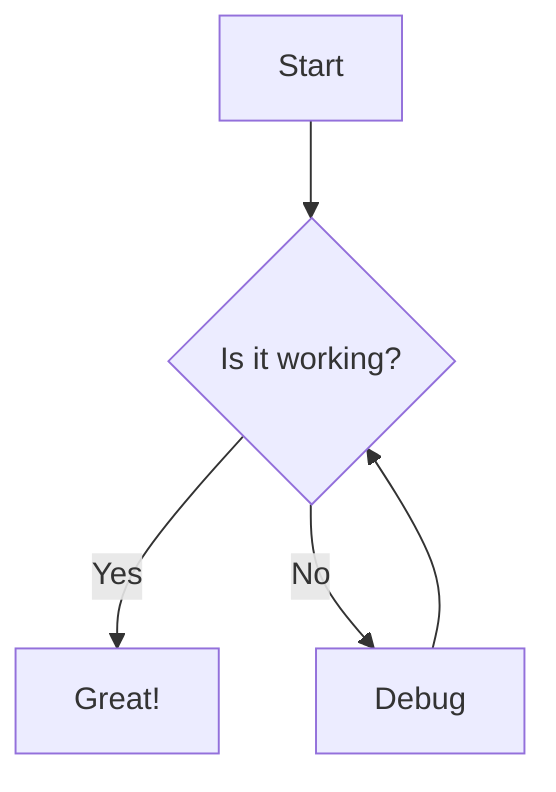

### Sequence Diagram

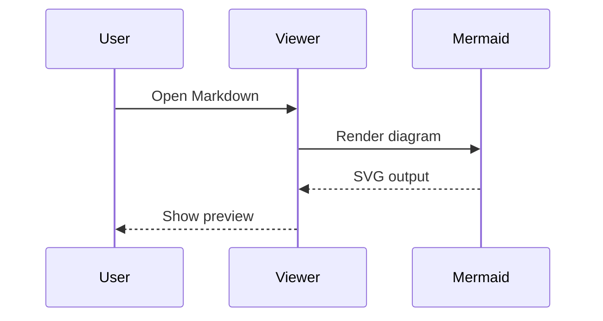

### Class Diagram

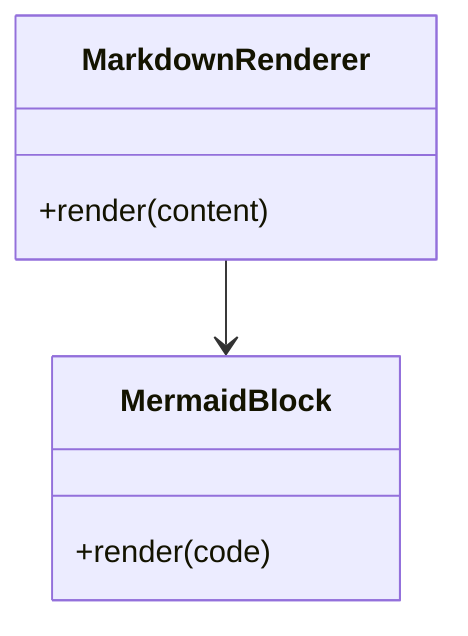

### State Diagram

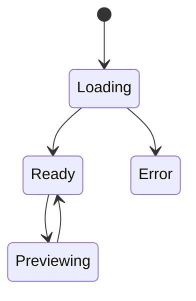

### Entity Relationship Diagram

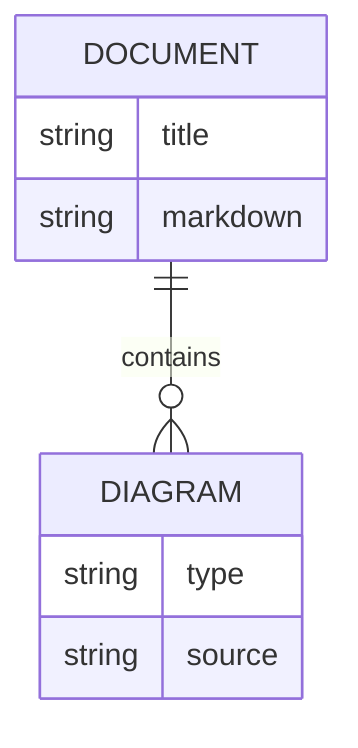

### User Journey

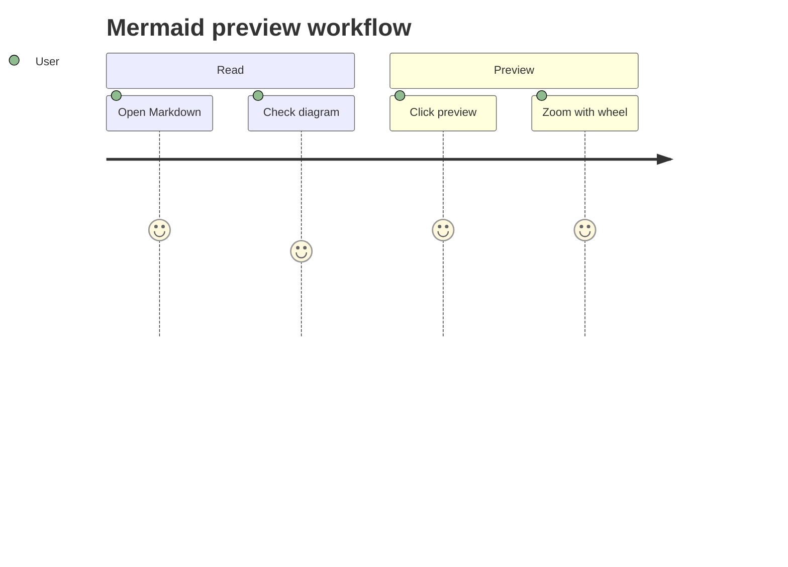

### Gantt

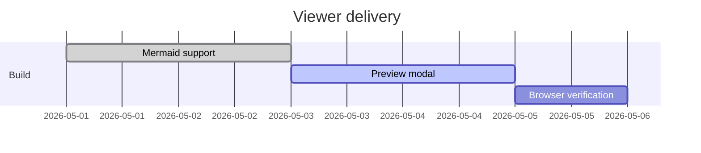

### Pie Chart

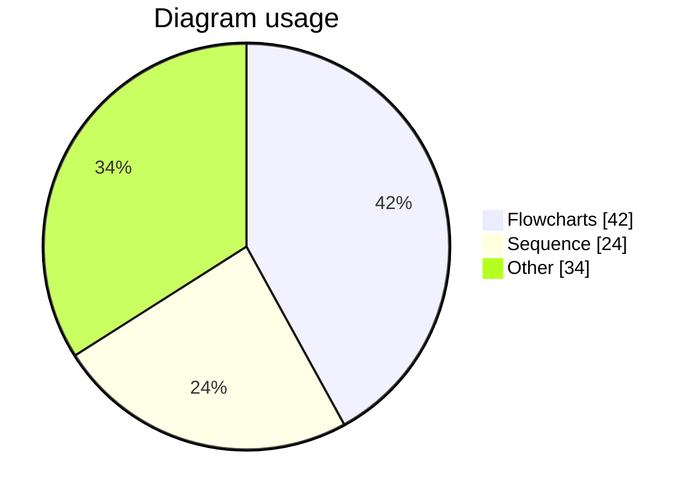

### Quadrant Chart

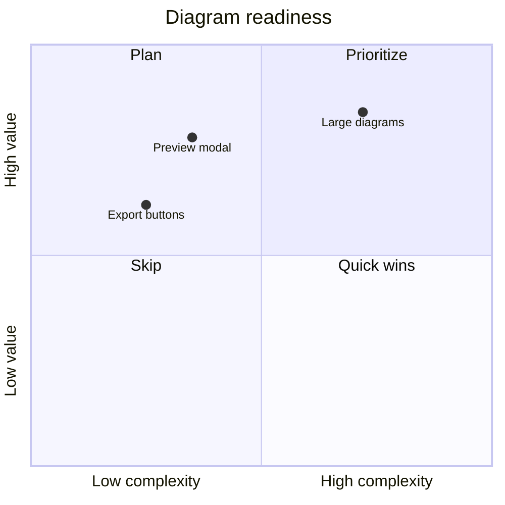

### XY Chart

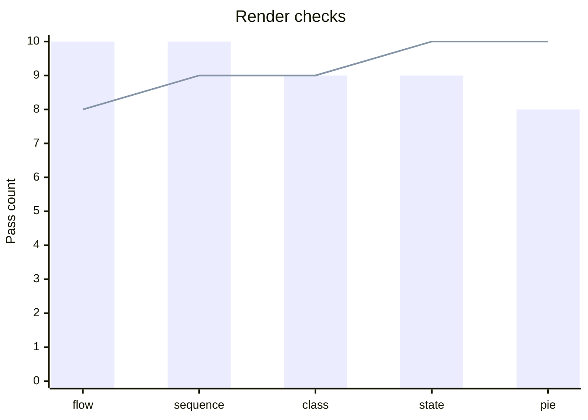

### Requirement Diagram

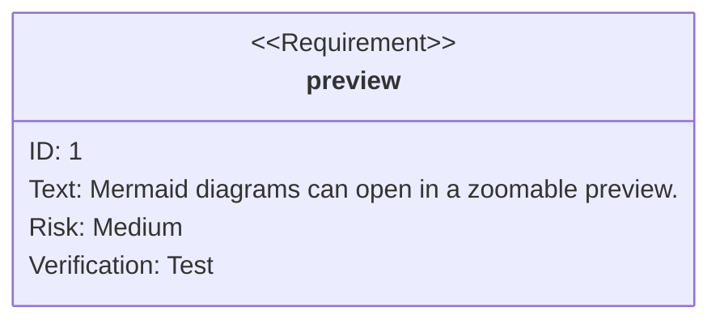

### Git Graph

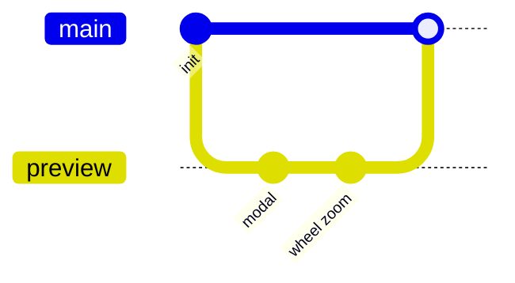

### Timeline

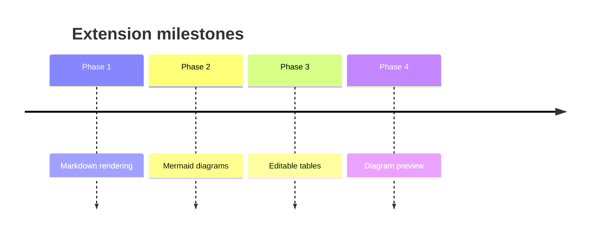

### Mindmap

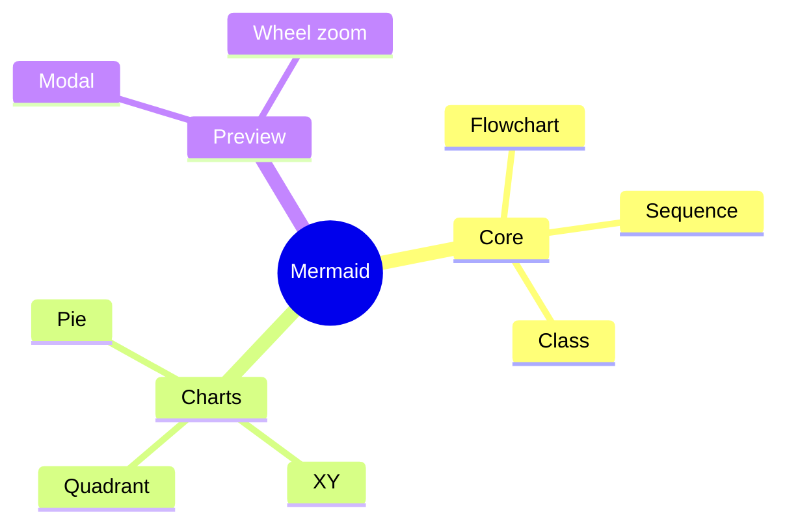

### Kanban

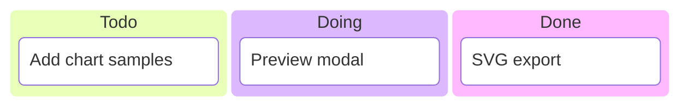

### Sankey

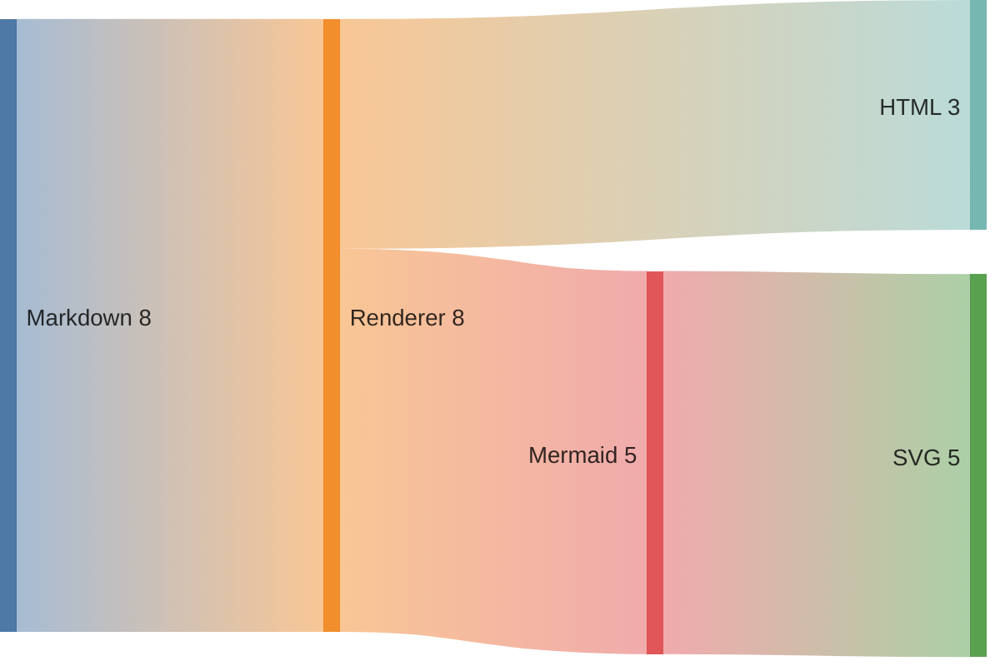

### Block Diagram


### Packet Diagram

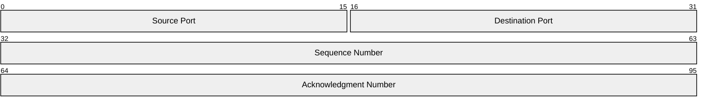

### Architecture Diagram

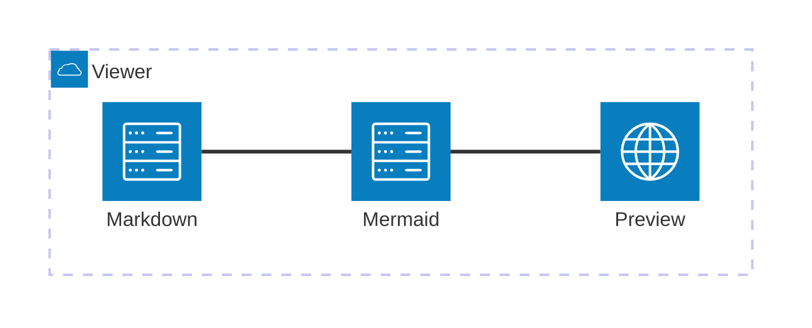

## Section 7: Links and Images

[Visit GitHub](https://github.com)


---

## Section 8: XSS Test

<script>alert('xss')</script>

The script tag above should NOT execute.

## Section 9: Invalid Mermaid

```mermaid
this is not valid mermaid syntax !!!
```

The block above should show an error state, not crash.
