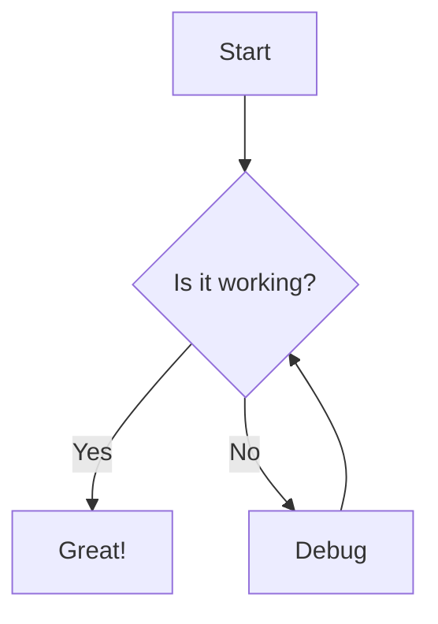

# Feishu MD Viewer E2E Test Document

This is a test document for verifying the Chrome extension rendering.

## Section 1: Basic Typography

This is a paragraph with **bold text**, *italic text*, and `inline code`.

### Subsection 1.1: Lists

- Item one
- Item two
  - Nested item
- Item three

1. First ordered
2. Second ordered
3. Third ordered

## Section 2: Code Block

```javascript
function hello(name) {
  const greeting = `Hello, ${name}!`;
  return greeting;
}

hello("Feishu");
```

## Section 3: Table

| Feature | Status | Notes |
|---------|--------|-------|
| Markdown Rendering | ✅ Done | Phase 1 |
| TOC Navigation | ✅ Done | Phase 2 |
| Document Editing | ✅ Done | Phase 3 |
| File Saving | ✅ Done | Phase 4 |
| Multi-platform | ✅ Done | Phase 5 |
| Dark Theme | ✅ Done | Phase 6 |

## Section 4: Blockquote

> This is a blockquote that should have a blue left border
> and a light blue background in Feishu style.

## Section 5: Mermaid Diagram



## Section 6: Links and Images

[Visit GitHub](https://github.com)

---

## Section 7: XSS Test

<script>alert('xss')</script>

The script tag above should NOT execute.

## Section 8: Invalid Mermaid

```mermaid
this is not valid mermaid syntax !!!
```

The block above should show an error state, not crash.
