# Feishu MD Viewer E2E Test Document

This is a test document for verifying the Chrome extension rendering.

## Section 1: Basic Typography

This is a paragraph with **bold text**, *italic text*, and `inline code`.

### Subsection 1.1: Lists

- Item one
- Item two
  - Nested item
- Item three

1. First ordered
2. Second ordered
3. Third ordered

### Subsection 1.2: Task Lists / Preview Checkboxes

预期：未选中勾选框使用浅色背景和清晰边框；已选中勾选框使用主题蓝色背景和白色勾选标记。勾选框在预览态只读，不应修改文档内容。

- [ ] 未完成任务：检查浅色背景、深色边框和与文字的垂直对齐
- [x] 已完成任务：检查蓝色背景、白色正向勾选标记
  - [ ] 嵌套未完成任务
  - [x] 嵌套已完成任务

### Subsection 1.3: Inline Styles and Links

**粗体**、*斜体*、***粗斜体***、~~删除线~~、`inline code`、
<https://github.com>、[GitHub Markdown Viewer](https://github.com/) 和自动换行文本。

链接预期：使用蓝色文字，悬停时颜色和背景有反馈，并在新标签页打开。

### Subsection 1.4: Long Text Wrapping

这是一段用于验证阅读态换行和页面宽度的长文本：Feishu Markdown Viewer should keep readable line length while long URLs, file paths, identifiers, and mixed Chinese-English content remain inside the document layout without causing the whole page to overflow horizontally. 示例路径：`/root/workspace/feishu-md-viewer/src/viewer/components/Markdown/FeishuComponents.tsx`。

---

## Section 1.5: Image Preview

预期：图片保持圆角、弱边界和合适的最大宽度；点击图片打开预览弹层，支持关闭、Esc 和焦点恢复。


图片加载失败时，正文应显示清晰的失败提示和原始地址，不应破坏相邻段落布局。


## Section 1.6: Horizontal Rule

上方内容和下方内容之间应显示低对比度分隔线。

---

分隔线下方的正文。

#### Heading Level 4

用于验证四级标题的字号、缩进、折叠按钮和目录定位。

##### Heading Level 5

用于验证五级标题的层级留白和标题定位。

###### Heading Level 6

用于验证六级标题的最小标题字号和长标题换行。

## Section 2: Code Block

```javascript
function hello(name) {
  const greeting = `Hello, ${name}!`;
  return greeting;
}

hello("Feishu");
```

### Code Block Variants

预期：代码块使用独立背景、圆角和等宽字体；右上角显示语言标签和复制按钮；长代码只在代码块内部滚动，不撑破正文。

```typescript
type PreviewFeature = {
  name: string;
  enabled: boolean;
};

const features: PreviewFeature[] = [
  { name: 'task checkbox', enabled: true },
  { name: 'table selection', enabled: true },
  { name: 'mermaid preview', enabled: true },
];
```

```json
{
  "mode": "read",
  "editing": false,
  "mermaid": "preview-only"
}
```

```text
This is a plain text code block.
It should preserve whitespace and remain readable on narrow screens.
```

## Section 3: Table

| Feature | Status | Notes |
|---------|--------|-------|
| Markdown Rendering | ✅ Done | Phase 1 |
| TOC Navigation | ✅ Done | Phase 2 |
| Document Editing | ✅ Done | Phase 3 |
| File Saving | ✅ Done | Phase 4 |
| Multi-platform | ✅ Done | Phase 5 |
| Dark Theme | ✅ Done | Phase 6 |

## Section 3.1: Table Width Strategy

下面这些表格用于验证阅读模式下的表格宽度策略：

- 1-3 列：保持中间正文宽度，不向右扩。
- 4-5 列：结合内容压力判断，短内容不扩，长路径/长代码/长说明向右扩。
- 6-8 列：默认向右扩。
- 9 列及以上：左右全扩，左右视口边距应一致。

### Compact Detail Table - Normal Width

预期：2 列详情表撑满中间正文宽度，不向右扩，也不缩成内容宽度。

| 项目 | 内容 |
| --- | --- |
| 同步方向 | RMS -> 零售后台 |
| 同步类型 | 单向 |
| 负责人 / 协同说明 | 井泉负责零售后台，RMS 国家 / 时区 / 货币主数据的同步链路和字段依赖 |
| RMS 表 | `new_country`, `new_countrytimezone`, `new_countrycurrency`, `new_region` |
| 零售后台表 | `intl_rms_country_timezone` |
| 什么情况会同步 | 国家、时区、货币、区域等基础数据在增量窗口内变化 |
| 关键字段 | 国家 ID、国家名、国家码、短码、时区名、时区码、货币码、区域、状态 |

### Four Short Columns - Normal Width

预期：4 列但内容很短，应保持中间正文宽度，不触发右扩。

| 模块 | Owner | 状态 | 日期 |
| --- | --- | --- | --- |
| 用户 | Rory | 已确认 | 2026-05-01 |
| 国家 | 井泉 | 评审中 | 2026-05-02 |
| 门店 | Fish | 待确认 | 2026-05-03 |

### Four Content Heavy Columns - Expand Right

预期：4 列但包含长入口、长代码路径和较长说明，应触发右扩；右侧边距不应越界。

| 入口 | 所属系统 | 功能 | 代码路 |
| --- | --- | --- | --- |
| `RMSDataSync_Timer` / `RMSDataSyncMinute_Timer` / `RMSDataSyncTenMinute1_Timer` / `RMSDataSyncThirtyMinute_Timer` | RMS Azure Function | 按不同周期扫描 Dataverse 实体增量，生成同步配置并推送到零售后台 DB 同步接口 | `/root/workspace/rms/AzureFunction/AzureFunctions/RMS2intl_DataSyncFunction/RMSDataSync.cs` |
| `RMSDataSync_HttpStart` | RMS Azure Function | 手动触发指定表同步，可通过 `tableName`, `Hour`, 分页参数控制 | `/root/workspace/rms/AzureFunction/AzureFunctions/RMS2intl_DataSyncFunction/RMSDataSync.cs` |
| `RmsSyncDbServiceImpl.syncRmsDbMsg` | 零售后台 | 接收 RMS DB 同步请求，按表名分流普通 Topic 与 Cold Topic | `/root/workspace/intl-retail/intl-retail-front/src/main/java/com/mi/info/intl/retail/sync/RmsSyncDbServiceImpl.java` |
| `RmsSyncDbConsumer` | 零售后台 | 消费 `${intl-retail.rocketmq.syncdb.topic}`，调用 `RmsSyncDbManager.editDb` 落库 | `/root/workspace/intl-retail/intl-retail-front/src/main/java/com/mi/info/intl/retail/sync/RmsSyncDbConsumer.java` |
| `RmsSyncDbColdConsumer` | 零售后台 | 消费 `${intl-retail.rocketmq.syncdb-cold.topic}`，处理库存上报类大表 | `/root/workspace/intl-retail/intl-retail-front/src/main/java/com/mi/info/intl/retail/sync/RmsSyncDbColdConsumer.java` |
| `RmsSyncDbManager.editDb` | 零售后台 | RMS 普通主数据同步总路由，按 `table` 分发到各业务服务 | `/root/workspace/intl-retail/intl-retail-front/src/main/java/com/mi/info/intl/retail/sync/RmsSyncDbManager.java` |

### Indented Section Right Expansion

预期：这个表格位于多级标题缩进区域内，右扩时应以表格所在内容盒为基准，左边界不能比正文缩进少或多一截。

#### Indented Four Column Table

| 零售后台表 | 业务含义 | 井泉负责点 | 协同人 / 备注 |
| --- | --- | --- | --- |
| `intl_rms_user` | 用户主数据 | 确认零售后台依赖哪些 RMS 用户字段、同步链路、增量条件、落库处理 | 人员档案变更写回 RMS 属于接口 / Action 范围，需和接口负责人确认 |
| `intl_rms_country_timezone` | 国家、时区、货币 | 确认国家 / 时区 / 货币字段在零售后台中的使用范围 | 影响多模块国家过滤、RMS token 区域判断 |
| `intl_rms_position` | 阵地主数据 | 确认零售后台依赖 RMS 阵地字段、ES 重建触发、表同步链路 | 门店 / 阵地业务口径与 Rory 岳天慧 协同 |
| `intl_rms_store` | 门店主数据 | 确认零售后台依赖 RMS 门店字段、ES 重建触发、表同步链路 | 门店 / 阵地业务口径与 Rory 岳天慧 协同 |
| `intl_rms_personnel_position_association` | 人员阵地关系 | 确认人店 / 人阵地关系同步链路和消费方 | 与人员、门店业务共同确认字段含义 |
| `intl_rms_sign_rule` | 签到规则 | 确认签到规则主数据落库与巡店 / 考勤侧使用 | 与 FieldForce / 考勤侧确认使用场景 |
| `intl_rms_retailer` | 零售商 | 确认 RMS Retailer 主数据下发、CRM 治理切换、零售后台推 RMS 的互补链路 | Retailer 创建 / 更新推 RMS 需和接口负责人确认 |

### Six Columns - Expand Right

预期：6 列默认右扩，右边界留出统一视口边距。

| 表名 | 系统 | 字段组 | 同步入口 | 消费方 | 备注 |
| --- | --- | --- | --- | --- | --- |
| `new_country` | RMS | 国家基础字段 | `RMSDataSync_ThirtyMinute_Timer` | `RmsSyncDbConsumer` | 国家、短码、状态变化会影响门店和报表筛选 |
| `new_countrytimezone` | RMS | 时区字段 | `RMSDataSync_ThirtyMinute_Timer` | `RmsSyncDbConsumer` | 时区变化会影响营业时间和定时任务 |
| `new_region` | RMS | 区域字段 | `RMSDataSync_ThirtyMinute_Timer` | `RmsSyncDbConsumer` | 区域变化会影响国家和门店关联 |

### Nine Columns - Balanced Expansion

预期：9 列及以上触发全扩，应在主内容区域内居中，不应压到左侧目录栏；左右边距应一致，不应出现明显不一致。

| 国家 | 时区 | 货币 | 区域 | 门店 | 阵地 | 人员 | 同步入口 | 代码路径 |
| --- | --- | --- | --- | --- | --- | --- | --- | --- |
| 中国 | Asia/Shanghai | CNY | CN-North | `intl_rms_store` | `intl_rms_position` | `intl_rms_user` | `RMSDataSync_ThirtyMinute_Timer` | `/root/workspace/rms/AzureFunction/AzureFunctions/RMS2intl_DataSyncFunction/RMSDataSync.cs` |
| 德国 | Europe/Berlin | EUR | EU-Central | `intl_rms_store` | `intl_rms_position` | `intl_rms_user` | `RMSDataSync_ThirtyMinute_Timer` | `/root/workspace/intl-retail/intl-retail-front/src/main/java/com/mi/info/intl/retail/sync/RmsSyncDbManager.java` |
| 阿联酋 | Asia/Dubai | AED | MEA | `intl_rms_store` | `intl_rms_position` | `intl_rms_user` | `RMSDataSync_ThirtyMinute_Timer` | `/root/workspace/intl-retail/intl-retail-front/src/main/java/com/mi/info/intl/retail/sync/RmsSyncDbServiceImpl.java` |

## Section 4: Blockquote

> This is a blockquote that should have a blue left border
> and a light blue background in Feishu style.

> Blockquotes can contain **bold text**, `inline code`, links, and multiple lines.
> They should preserve the left accent border without becoming too dark.

## Section 5: Callouts

> [!NOTE]
> Note callouts are for neutral context, extra reading notes, and background information.

> [!TIP]
> Tip callouts should feel useful and lightweight, like a quick shortcut inside a Feishu document.

> [!WARNING]
> Warning callouts highlight things that need attention before continuing.

> [!IMPORTANT]
> Important callouts should stand out without overpowering the rest of the document.

> [!CAUTION]
> Caution callouts are for destructive or risky operations.

### Callout with Rich Content

> [!TIP]
> Use the目录、搜索、字号和主题控制来验证阅读态交互。相关代码路径是 `src/viewer/App.tsx`。

## Section 5.1: Mixed Content Flow

这一节用于确认多个块连续出现时的间距、层级和留白：

- 普通列表项
- 包含 **强调** 和 `代码` 的列表项

> [!NOTE]
> 紧跟在列表后的 Callout 不应与列表发生粘连。

| 块类型 | 前后间距 | 预期 |
| --- | --- | --- |
| Paragraph | 标准 | 与上下正文保持呼吸感 |
| Callout | 加强 | 保留主题色左边框 |
| Code block | 加强 | 工具栏不遮挡内容 |

## Section 6: Mermaid Diagram Types

### Flowchart

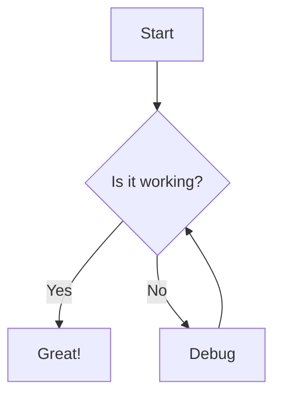
```mermaid
graph TD
    A[Start] --> B{Is it working?}
    B -->|Yes| C[Great!]
    B -->|No| D[Debug]
    D --> B
```

### Sequence Diagram

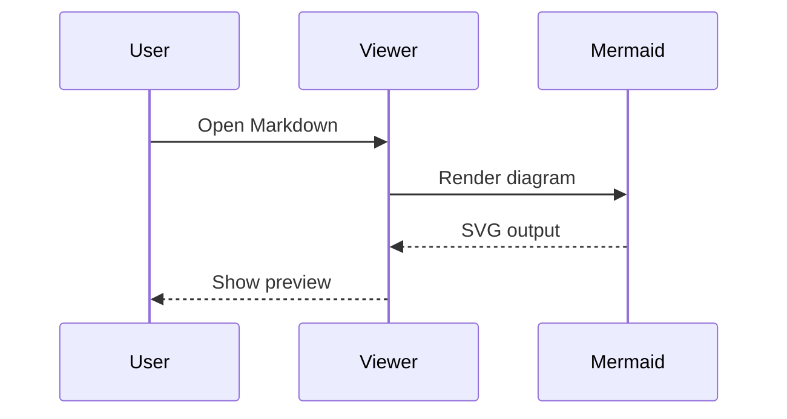
```mermaid
sequenceDiagram
    participant User
    participant Viewer
    participant Mermaid
    User->>Viewer: Open Markdown
    Viewer->>Mermaid: Render diagram
    Mermaid-->>Viewer: SVG output
    Viewer-->>User: Show preview
```

### Class Diagram

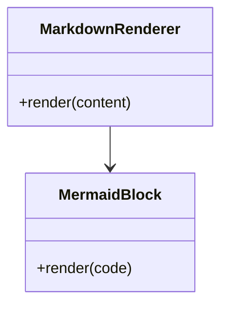
```mermaid
classDiagram
    class MarkdownRenderer {
      +render(content)
    }
    class MermaidBlock {
      +render(code)
    }
    MarkdownRenderer --> MermaidBlock
```

### State Diagram

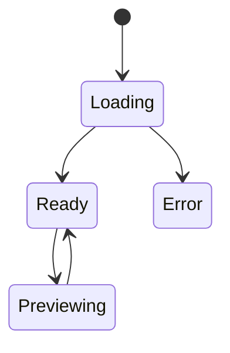
```mermaid
stateDiagram-v2
    [*] --> Loading
    Loading --> Ready
    Loading --> Error
    Ready --> Previewing
    Previewing --> Ready
```

### Entity Relationship Diagram

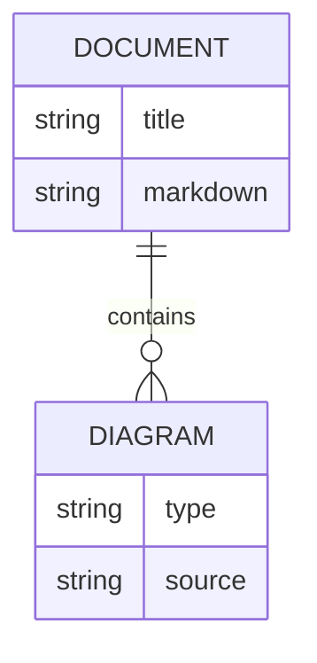
```mermaid
erDiagram
    DOCUMENT ||--o{ DIAGRAM : contains
    DIAGRAM {
      string type
      string source
    }
    DOCUMENT {
      string title
      string markdown
    }
```

### User Journey

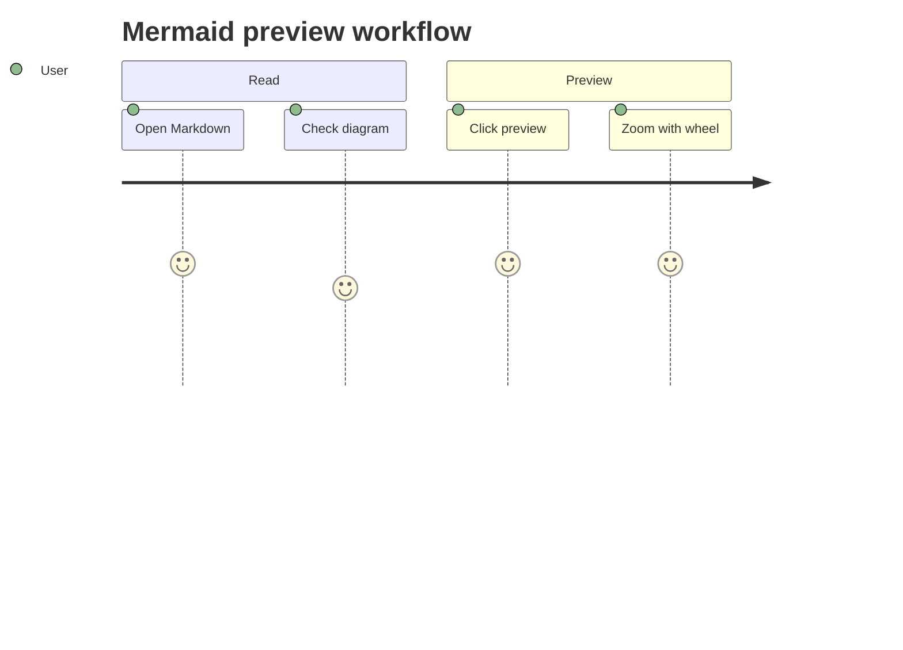
```mermaid
journey
    title Mermaid preview workflow
    section Read
      Open Markdown: 5: User
      Check diagram: 4: User
    section Preview
      Click preview: 5: User
      Zoom with wheel: 5: User
```

### Gantt

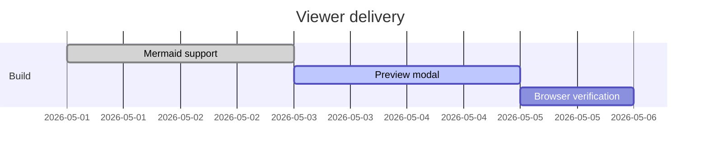
```mermaid
gantt
    title Viewer delivery
    dateFormat  YYYY-MM-DD
    section Build
    Mermaid support       :done,    a1, 2026-05-01, 2d
    Preview modal         :active,  a2, after a1, 2d
    Browser verification  :         a3, after a2, 1d
```

### Pie Chart

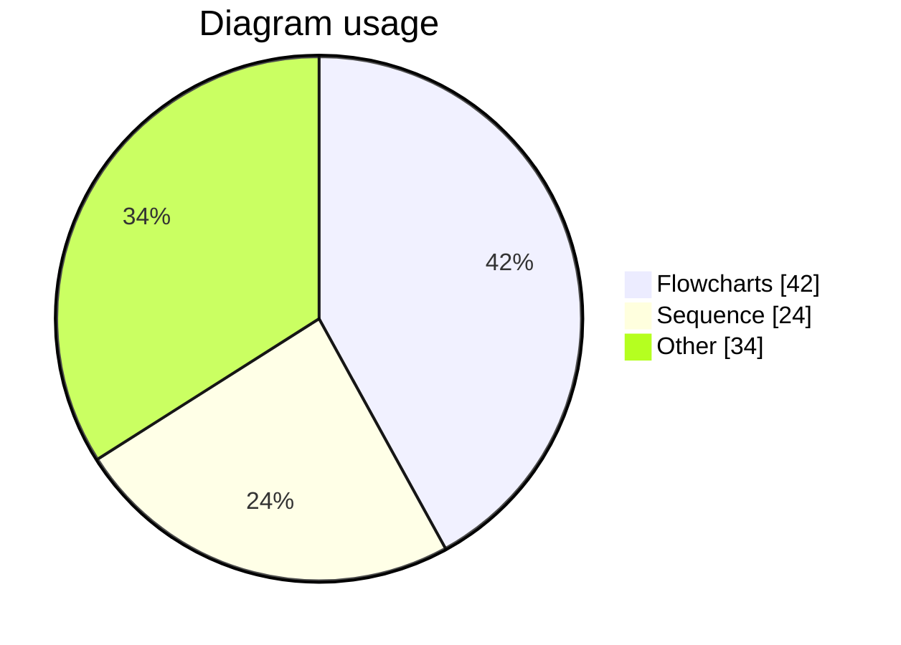
```mermaid
pie showData
    title Diagram usage
    "Flowcharts" : 42
    "Sequence" : 24
    "Other" : 34
```

### Quadrant Chart

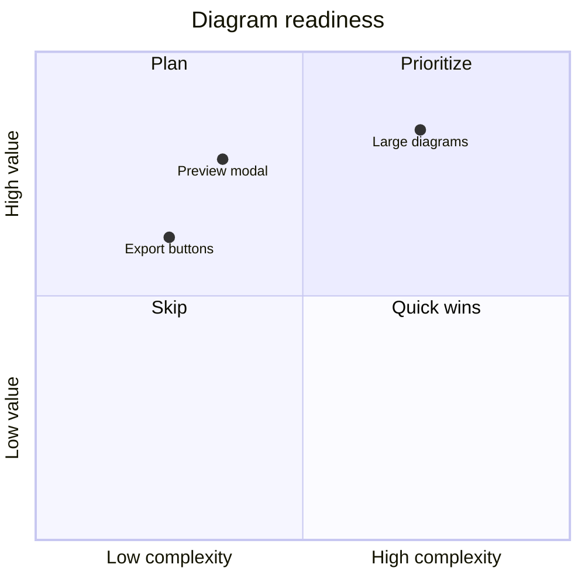
```mermaid
quadrantChart
    title Diagram readiness
    x-axis Low complexity --> High complexity
    y-axis Low value --> High value
    quadrant-1 Prioritize
    quadrant-2 Plan
    quadrant-3 Skip
    quadrant-4 Quick wins
    Preview modal: [0.35, 0.78]
    Export buttons: [0.25, 0.62]
    Large diagrams: [0.72, 0.84]
```

### XY Chart

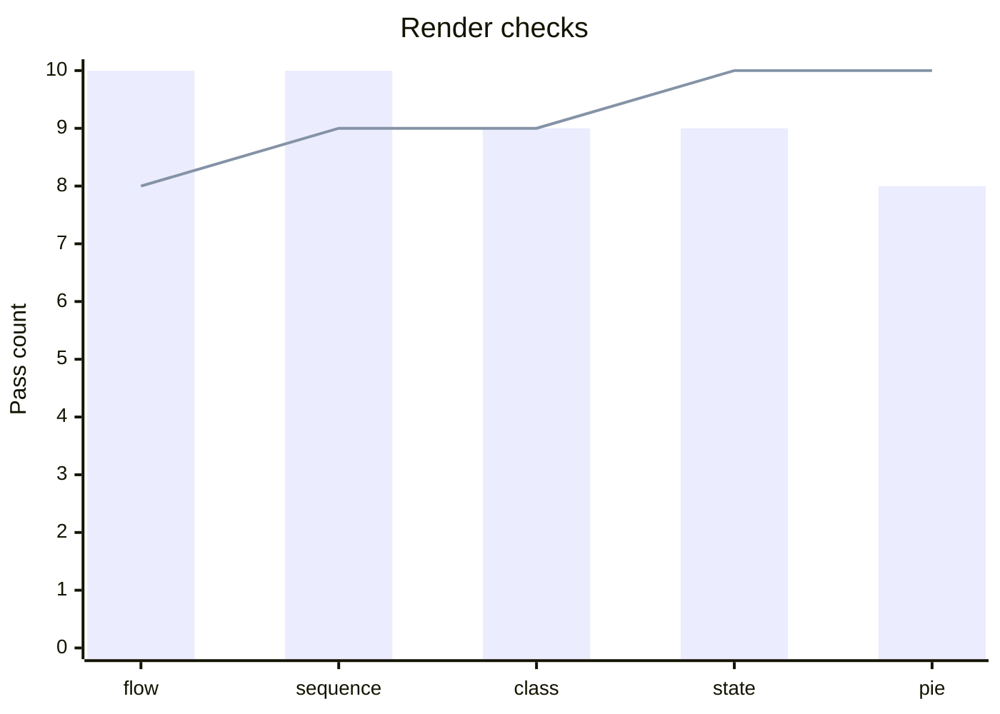
```mermaid
xychart-beta
    title "Render checks"
    x-axis [flow, sequence, class, state, pie]
    y-axis "Pass count" 0 --> 10
    bar [10, 10, 9, 9, 8]
    line [8, 9, 9, 10, 10]
```

### Requirement Diagram

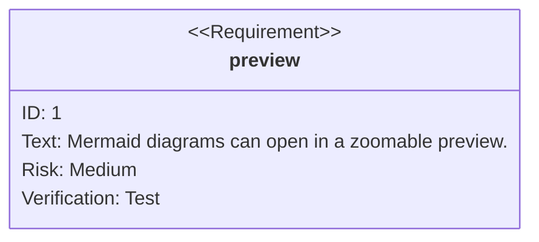
```mermaid
requirementDiagram
    requirement preview {
      id: 1
      text: Mermaid diagrams can open in a zoomable preview.
      risk: medium
      verifymethod: test
    }
```

### Git Graph

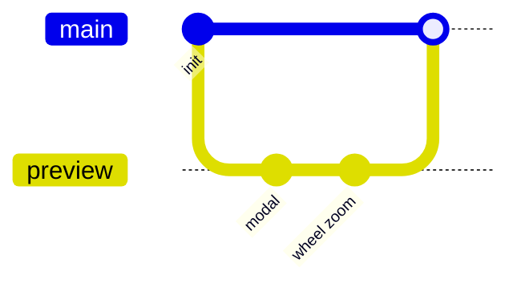
```mermaid
gitGraph
    commit id: "init"
    branch preview
    checkout preview
    commit id: "modal"
    commit id: "wheel zoom"
    checkout main
    merge preview
```

### Timeline

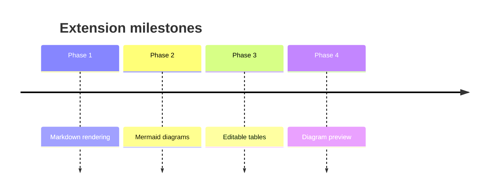
```mermaid
timeline
    title Extension milestones
    Phase 1 : Markdown rendering
    Phase 2 : Mermaid diagrams
    Phase 3 : Editable tables
    Phase 4 : Diagram preview
```

### Mindmap

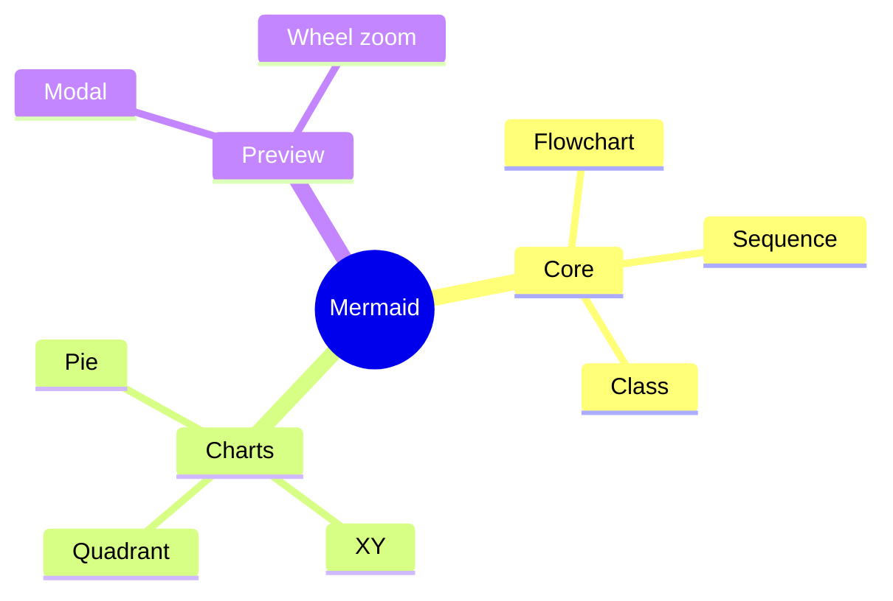
```mermaid
mindmap
  root((Mermaid))
    Core
      Flowchart
      Sequence
      Class
    Charts
      Pie
      XY
      Quadrant
    Preview
      Modal
      Wheel zoom
```

### Kanban

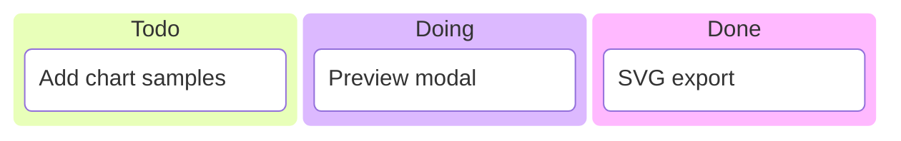
```mermaid
kanban
  Todo
    [Add chart samples]
  Doing
    [Preview modal]
  Done
    [SVG export]
```

### Sankey

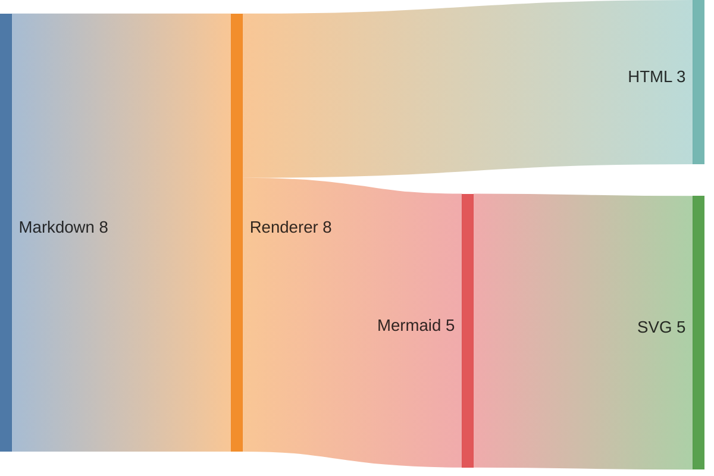
```mermaid
sankey-beta
Markdown,Renderer,8
Renderer,Mermaid,5
Renderer,HTML,3
Mermaid,SVG,5
```

### Block Diagram


```mermaid
block-beta
  columns 3
  source["Markdown"] render["Renderer"] svg["SVG"]
  source --> render
  render --> svg
```

### Packet Diagram

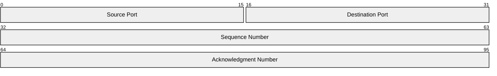
```mermaid
packet-beta
0-15: "Source Port"
16-31: "Destination Port"
32-63: "Sequence Number"
64-95: "Acknowledgment Number"
```

### Architecture Diagram

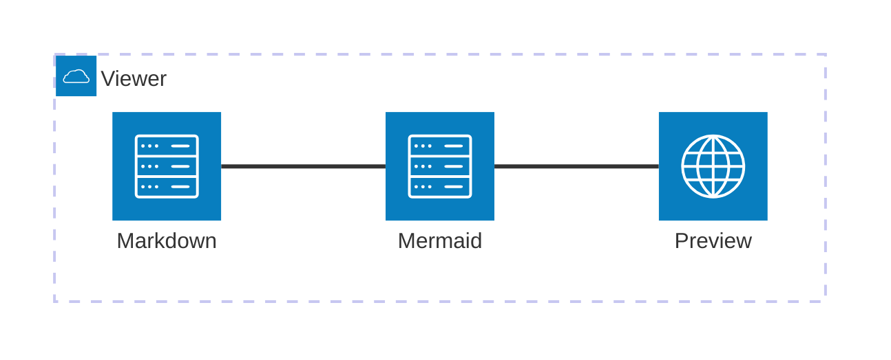
```mermaid
architecture-beta
    group app(cloud)[Viewer]
    service markdown(server)[Markdown] in app
    service mermaid(server)[Mermaid] in app
    service preview(internet)[Preview] in app
    markdown:R -- L:mermaid
    mermaid:R -- L:preview
```

## Section 7: Links and Images

[Visit GitHub](https://github.com)


---

## Section 8: XSS Test

<script>alert('xss')</script>

The script tag above should NOT execute.

## Section 9: Invalid Mermaid

```mermaid
this is not valid mermaid syntax !!!
```
231231343234324233242332131

## 第 10 节：复杂与长 Mermaid 验收

本节用于验证长流程图在真实阅读场景下的预览体验。重点检查：

- 点击正文中的流程图后，是否进入全屏画布，而不是小弹窗；
- 画布中的图形是否整体居中，节点和连线不被裁切；
- 使用鼠标滚轮时只进行上下滚动，不应意外缩放图形；
- 缩放、拖拽、旋转（如支持）后，退出再重新打开时状态是否稳定；
- 点击左上角“× 退出”或“退出”文字后，是否回到原来的正文滚动位置；
- 长图在浅色和深色主题下都保持足够的文字、节点和连线对比度；
- 图表加载失败时，错误提示应位于图表区域内，不应让整页消失或出现水平溢出。

### 10.1 长分支流程图

预期：图表包含多个分支和回环，打开全屏预览后应能完整滚动浏览；长节点文本不能把节点撑出画布，连线不能与文字严重重叠。

```mermaid
flowchart TD
    A([开始：打开 Markdown 文档]) --> B{文件是否存在}
    B -->|否| C[显示文件不存在提示]
    C --> Z([结束])
    B -->|是| D[读取文件内容]
    D --> E{文件是否发生变化}
    E -->|否| F[复用当前渲染结果]
    E -->|是| G[局部更新正文]
    F --> H{是否包含 Mermaid 代码块}
    G --> H
    H -->|否| I[渲染普通 Markdown]
    H -->|是| J[提取 Mermaid 源码]
    J --> K{语法是否有效}
    K -->|否| L[显示 Mermaid 错误提示]
    L --> M[保留原始源码供排查]
    M --> N{用户是否点击重试}
    N -->|否| Z
    N -->|是| J
    K -->|是| O[生成 SVG 图表]
    O --> P{图表是否超出正文宽度}
    P -->|否| Q[按正文宽度居中显示]
    P -->|是| R[进入可滚动画布模式]
    R --> S[保留原生滚动条]
    S --> T{用户是否点击图表}
    Q --> T
    T -->|否| U[继续阅读正文]
    T -->|是| V[打开全屏流程图画布]
    V --> W[图表居中并保留安全边距]
    W --> X{用户操作}
    X -->|滚轮| Y[上下滚动画布]
    X -->|拖拽| AA[平移图表]
    X -->|缩放按钮| AB[按步长缩放]
    X -->|退出| AC[关闭画布并恢复正文位置]
    Y --> X
    AA --> X
    AB --> X
    AC --> U
    I --> U
    U --> AD{用户是否切换主题}
    AD -->|是| AE[重新应用主题变量]
    AE --> U
    AD -->|否| Z
```

### 10.2 大型子图与跨分组连线

预期：子图之间存在跨区域连接，验证全屏模式下布局是否稳定；目录、正文和图表之间的层级不应互相遮挡。

```mermaid
flowchart LR
    subgraph Client[客户端：浏览器或 VS Code]
        C1[打开 Markdown]
        C2[监听文件变化]
        C3[更新阅读视图]
        C4[打开全屏画布]
        C1 --> C2 --> C3 --> C4
    end

    subgraph Parse[解析层]
        P1[读取 Markdown]
        P2[remark 解析]
        P3[rehype 转换]
        P4[安全过滤]
        P1 --> P2 --> P3 --> P4
    end

    subgraph Render[渲染层]
        R1[普通 Markdown 块]
        R2[表格渲染]
        R3[代码块渲染]
        R4[Mermaid 渲染]
        R5[错误降级]
        R1 --> R5
        R2 --> R5
        R3 --> R5
        R4 --> R5
    end

    subgraph Interaction[交互层]
        I1[目录定位]
        I2[标题临时高亮]
        I3[图表缩放]
        I4[画布滚动]
        I5[退出全屏]
        I1 --> I2
        I3 --> I4 --> I5
    end

    C1 --> P1
    C2 --> P1
    P4 --> R1
    P4 --> R2
    P4 --> R3
    P4 --> R4
    R4 --> C4
    C3 --> I1
    C4 --> I3
    I5 --> C3
    R5 --> C3
```

### 10.3 长时序图

预期：参与者较多、消息较长时，时序图文字仍清晰可读；全屏画布可以上下滚动，消息箭头不会被顶部工具栏遮挡。

```mermaid
sequenceDiagram
    autonumber
    actor User as 用户
    participant Browser as 浏览器页面
    participant Content as Content Script
    participant Parser as Markdown Parser
    participant Sanitizer as HTML Sanitizer
    participant Mermaid as Mermaid Renderer
    participant Store as Settings Store
    participant Canvas as Fullscreen Canvas

    User->>Browser: 打开本地 Markdown 文件
    Browser->>Content: 注入阅读视图
    Content->>Store: 读取主题、字号、目录和滚动设置
    Store-->>Content: 返回持久化设置
    Content->>Parser: 发送 Markdown 文本
    Parser->>Parser: 解析标题、表格、代码块和 HTML
    Parser->>Sanitizer: 发送待过滤的 HTML AST
    Sanitizer-->>Parser: 返回安全 HTML AST
    Parser-->>Content: 返回普通内容和 Mermaid 源码块
    Content->>Mermaid: 渲染第一个 Mermaid 图表
    Mermaid-->>Content: 返回 SVG 或错误结果
    Content->>Mermaid: 渲染第二个 Mermaid 图表
    Mermaid-->>Content: 返回 SVG 或错误结果
    Content-->>Browser: 更新正文和目录
    User->>Browser: 点击流程图
    Browser->>Canvas: 创建全屏画布
    Canvas->>Canvas: 计算图表边界并居中
    Canvas-->>User: 展示全屏流程图
    User->>Canvas: 使用滚轮向下浏览长图
    Canvas-->>User: 只滚动画布，不改变缩放比例
    User->>Canvas: 点击放大按钮
    Canvas->>Canvas: 按固定步长更新缩放
    Canvas-->>User: 保持当前视觉中心
    User->>Canvas: 点击退出
    Canvas-->>Browser: 关闭画布
    Browser-->>User: 恢复原正文位置和目录状态
```

### 10.4 带错误恢复的长状态图

预期：错误状态、重试状态和成功状态之间的切换明确；错误 Mermaid 不应阻塞同一文档中的其他图表。

```mermaid
stateDiagram-v2
    [*] --> Idle
    Idle --> Loading: 打开文档
    Loading --> Parsing: 文件读取成功
    Loading --> LoadError: 文件读取失败
    LoadError --> Loading: 用户点击重试
    LoadError --> [*]: 用户关闭文档
    Parsing --> Rendering: Markdown 解析成功
    Parsing --> ParseError: Markdown 解析失败
    ParseError --> Parsing: 内容更新
    Rendering --> MermaidPending: 发现 Mermaid 代码块
    Rendering --> Ready: 没有 Mermaid 代码块
    MermaidPending --> MermaidRendering: 开始渲染
    MermaidRendering --> MermaidReady: SVG 生成成功
    MermaidRendering --> MermaidError: SVG 生成失败
    MermaidError --> MermaidRendering: 用户点击重试
    MermaidError --> ReadyWithFallback: 使用错误降级视图
    MermaidReady --> Ready
    ReadyWithFallback --> Ready
    Ready --> PreviewOpen: 点击任意图表
    PreviewOpen --> PreviewScrolling: 滚轮操作
    PreviewScrolling --> PreviewOpen: 停止滚动
    PreviewOpen --> PreviewZooming: 点击缩放
    PreviewZooming --> PreviewOpen: 缩放完成
    PreviewOpen --> Ready: 点击退出
```

### 10.5 宽流程图与水平溢出

预期：图表宽度明显超过正文可视区域时，外层布局仍保持稳定；应出现可用的原生水平滚动条，页面背景不能出现黑边或空白断层。

```mermaid
flowchart LR
    A[入口：用户打开文档] --> B[读取文件]
    B --> C[解析 front matter]
    C --> D[解析标题]
    D --> E[生成目录]
    E --> F[解析段落]
    F --> G[解析列表]
    G --> H[解析表格]
    H --> I[解析代码块]
    I --> J[解析图片]
    J --> K[解析 HTML]
    K --> L[解析 Mermaid 01]
    L --> M[解析 Mermaid 02]
    M --> N[解析 Mermaid 03]
    N --> O[解析 Mermaid 04]
    O --> P[解析 Mermaid 05]
    P --> Q[生成正文布局]
    Q --> R[应用目录宽度]
    R --> S[计算内容宽度]
    S --> T[限制外框最大宽度]
    T --> U[决定是否显示水平滚动条]
    U --> V[应用左右滚动阴影]
    V --> W[允许用户拖拽滚动条]
    W --> X[保持目录浮层可点击]
```

### 10.6 单文档多图表

预期：同一文档内连续放置多个图表时，单击某一张图只打开当前图；切换上一张/下一张时蒙版、工具栏和图表内容不应闪烁，图片或其他图表不应被误替换。

```mermaid
flowchart TD
    A[图表 1：文档加载] --> B[图表 2：解析完成]
    B --> C[图表 3：主题切换]
    C --> D[图表 4：宽度变化]
    D --> E[图表 5：错误降级]
    E --> F[图表 6：恢复成功]
    F --> G[图表 7：全屏预览]
    G --> H[图表 8：滚动到底部]
    H --> I[图表 9：退出预览]
```

### 10.7 有效图表旁的非法语法

预期：非法 Mermaid 只在当前图表位置显示错误，不影响相邻的有效图表、目录和正文。

```mermaid
flowchart TD
    A[有效图表仍应显示] --> B[下一张有效图表]
```

```mermaid
this is deliberately invalid Mermaid syntax for fallback testing
```

```mermaid
sequenceDiagram
    participant A as 有效图表
    participant B as 相邻图表
    A->>B: 非法图表不应阻塞这一张
```

### 10.8 长内容回归检查清单

打开本文件并完成以下检查：

1. 从目录跳转到“10.1 长分支流程图”，目标标题应立即出现临时高亮，并在约 2 秒后消失。
2. 点击长流程图，确认进入全屏画布；画布中的图表整体居中，顶部和底部没有被裁切。
3. 在画布内滚轮上下滚动，确认滚动的是图表视口，不是后面的正文页面。
4. 将窗口缩窄到约一半宽度，确认长图仍可滚动，正文背景和外框保持连续。
5. 切换浅色/深色主题，确认节点、文字、箭头、工具栏和滚动阴影都有足够对比度。
6. 点击“10.7 有效图表旁的非法语法”中的非法图表，确认只有当前图表降级，前后有效图表仍可用。
7. 在文档中切换其他选项卡再切回来，确认不会回到顶部、不会重复创建多个画布，也不会造成目录闪动。

## 第 11 节：GitHub README 兼容性验收

本节用于验证常见 GitHub README 结构在 Chrome 本地 `file://` 页面和 VS Code Webview 中的显示结果。每项都记录为 `PASS`、`DEGRADED`、`UNSUPPORTED` 或 `BLOCKED`，不能把“单元测试通过”直接当作 Chrome / VS Code 实机通过。

### 11.1 GitHub 特有的 HTML 展示结构

预期：安全的展示性 HTML 被保留或安全转换；不支持的结构保留可读文本并给出合理降级，不应阻塞后续 Markdown 内容。

<details open>
  <summary>已展开的 README 说明</summary>

`details` 内可以包含段落、列表和代码：

- 展开状态在首次加载时可见
- 点击 summary 可以收起和重新展开
- 收起后正文后续内容仍可正常滚动

```bash
echo "details content"
```
</details>

<details>
  <summary>默认收起的 README 说明</summary>

这段内容首次加载时应隐藏，点击 summary 后显示。
</details>

<picture>
  <source media="(prefers-color-scheme: dark)" srcset="https://raw.githubusercontent.com/github/explore/main/topics/markdown/markdown.png" />
  <source media="(prefers-color-scheme: light)" srcset="./assets/light-demo.png" />
  
</picture>

快捷键说明：<kbd>Ctrl</kbd> + <kbd>Enter</kbd> 提交，<kbd>Esc</kbd> 关闭预览。

<video controls preload="metadata" poster="./assets/video-poster.png" width="480" height="270">
  <source src="./assets/demo.mp4" type="video/mp4" />
  当前环境不支持视频播放，请显示这段回退文本。
</video>

<div align="center">
  <strong>GitHub README 居中内容</strong>
</div>

<div class="readme-demo-row">
  <span>布局块 A</span>
  <span>布局块 B</span>
</div>

检查：

1. `details` / `summary` 的展开、收起状态可操作，且不会造成页面横向溢出。
2. `picture` 优先显示可用的 `img` 回退内容，`source` 不应产生空白占位。
3. `kbd` 显示为清晰的快捷键标签，不应被当成代码块或标题。
4. `video` 保留用户控制按钮；资源不存在时显示回退文本，不阻塞后续内容。
5. `div align="center"` 保留合理的居中效果；未知 class 不应注入任意样式。

### 11.2 GitHub 图片、徽章和贡献者区域

预期：外链图片、Raw 图片、徽章、贡献者图片和懒加载属性都能安全处理；加载失败时显示可识别的替代文本或失败状态。


[](https://github.com/JQQQQQQQ/feishu-md-viewer/graphs/contributors)


检查：

1. 点击图片进入图片预览，预览内容不应被额外的黑色图片框包裹。
2. 图片预览工具栏显示上一张、当前位置、总数、下一张；点击图片外部可以关闭。
3. 徽章和贡献者图片可以正常显示或安全降级，不能把图片地址渲染为普通代码文本。
4. `loading="lazy"` 和 `decoding="async"` 不会被误解析成可见文本。
5. 本地相对图片不存在时，显示失败状态但不影响目录、表格和 Mermaid。

### 11.3 GFM 表格与原生 HTML 表格

预期：GFM 表格和 HTML 表格都保留表头语义、圆角、交替行背景和原生水平滚动体验。

| README 场景 | Chrome | VS Code | 预期处理 |
| --- | --- | --- | --- |
| GFM 表格 | 待验收 | 待验收 | 使用现有表格选择和复制逻辑 |
| HTML 表格 | 待验收 | 待验收 | 保留 `thead` / `tbody` 结构 |
| 超宽表格 | 待验收 | 待验收 | 外框固定，表格内部原生滚动 |

<table id="html-table">
  <caption>HTML Table 兼容性检查</caption>
  <thead>
    <tr>
      <th>项目</th>
      <th>状态</th>
      <th>备注</th>
    </tr>
  </thead>
  <tbody>
    <tr>
      <td>表头复制</td>
      <td>待验收</td>
      <td>粘贴到 Excel 后应识别为表格列</td>
    </tr>
    <tr>
      <td>长内容</td>
      <td>待验收</td>
      <td>列宽调整不应挤压其他列</td>
    </tr>
  </tbody>
</table>

检查：

1. 点击 HTML 表格上边框可以选择整列，点击左边框可以选择整行。
2. 选中隐藏滚动区域后拖动，表格会自动向对应方向滚动，不要求鼠标始终停在边框热区内。
3. 复制表头和数据后粘贴到 Excel，列和行仍能被识别，不应全部拼接成一段普通文本。
4. 表格缩放、目录收起和正文居中不会在外框与表格之间产生空白缝隙。

#### 11.3.1 合并单元格展示

预期：`rowspan` 和 `colspan` 保留原生合并关系，不生成假的空白单元格；合并区域的边框、背景、内边距和文字垂直对齐与普通单元格一致。

<table>
  <caption>项目进度总览</caption>
  <thead>
    <tr>
      <th rowspan="2">项目</th>
      <th colspan="2">进度</th>
    </tr>
    <tr>
      <th>负责人</th>
      <th>状态</th>
    </tr>
  </thead>
  <tbody>
    <tr>
      <td rowspan="2">Markdown 预览</td>
      <td>小 Q</td>
      <td>已完成</td>
    </tr>
    <tr>
      <td colspan="2">后续进行 GitHub README 兼容性验收</td>
    </tr>
  </tbody>
</table>

检查：

1. `项目进度总览` 显示为飞书风格的表格标题栏，不参与行列选择。
2. `进度` 横向跨两列，`项目` 纵向跨两行，表格网格没有额外的空白占位格。
3. 合并区域的文字保持可读，长文本不会撑破外框；超出时仍使用表格内部水平滚动。
4. 浅色和深色主题下，合并区域的背景、边框和文字对比度保持一致。
5. 点击合并区域时，至少应将该合并单元格作为一个视觉单元高亮；如果行列选择暂不覆盖复杂合并关系，记录为 `DEGRADED`，不能影响普通表格。

#### 11.3.2 多级表头与分类合并

预期：多层表头在预览中保持层级关系，横向和纵向合并不生成重复文字或假空白格；复制到 Excel 后每一层表头都位于表头区域并保留背景色。

<table>
  <caption>季度项目资源分配</caption>
  <thead>
    <tr>
      <th rowspan="3">团队</th>
      <th rowspan="3">项目</th>
      <th colspan="4">2026 年上半年</th>
      <th colspan="2">汇总</th>
    </tr>
    <tr>
      <th colspan="2">第一季度</th>
      <th colspan="2">第二季度</th>
      <th rowspan="2">总人日</th>
      <th rowspan="2">完成率</th>
    </tr>
    <tr>
      <th>计划</th>
      <th>实际</th>
      <th>计划</th>
      <th>实际</th>
    </tr>
  </thead>
  <tbody>
    <tr>
      <td rowspan="2">阅读体验组</td>
      <td>Markdown 预览</td>
      <td>24</td>
      <td>22</td>
      <td>30</td>
      <td>28</td>
      <td>50</td>
      <td>92%</td>
    </tr>
    <tr>
      <td>表格交互</td>
      <td>18</td>
      <td>20</td>
      <td>26</td>
      <td>24</td>
      <td>44</td>
      <td>100%</td>
    </tr>
    <tr>
      <td>图表组</td>
      <td>Mermaid 画布</td>
      <td>16</td>
      <td>14</td>
      <td>22</td>
      <td>25</td>
      <td>39</td>
      <td>88%</td>
    </tr>
  </tbody>
</table>

检查：

1. `团队` 和 `项目` 在三层表头中保持正确的纵向合并，不在后续表头行重复出现。
2. `2026 年上半年` 横向跨越四个季度明细列，`第一季度`、`第二季度`各自跨越计划/实际两列。
3. `总人日`、`完成率`在第二、第三层表头中保持纵向合并，右侧不出现假的空白单元格。
4. 从“计划”拖到“实际”以及从第一季度拖到第二季度，单元格框选可以覆盖完整的逻辑列范围。
5. 复制整张表到 Excel，三行表头都应处于表头区域并显示浅灰色背景。

#### 11.3.3 行列交叉合并与空值

预期：行列同时存在合并、空值和跨区域说明时，表格仍按逻辑网格布局；空值只表示真正空白，不被错误补成重复单元格。

<table>
  <caption>发布验收矩阵</caption>
  <thead>
    <tr>
      <th rowspan="2">验收阶段</th>
      <th colspan="3">浏览器</th>
      <th colspan="2">VS Code</th>
      <th rowspan="2">结论</th>
    </tr>
    <tr>
      <th>浅色</th>
      <th>深色</th>
      <th>自动刷新</th>
      <th>Webview</th>
      <th>文件更新</th>
    </tr>
  </thead>
  <tbody>
    <tr>
      <td rowspan="2">Markdown 兼容性</td>
      <td>通过</td>
      <td>通过</td>
      <td>通过</td>
      <td>通过</td>
      <td></td>
      <td rowspan="2">可发布</td>
    </tr>
    <tr>
      <td colspan="2">需要人工确认长表格颜色</td>
      <td>通过</td>
      <td></td>
      <td>通过</td>
    </tr>
    <tr>
      <td>Mermaid 图表</td>
      <td colspan="3">流程图、时序图和长图均已验证</td>
      <td>通过</td>
      <td>通过</td>
      <td>可发布</td>
    </tr>
    <tr>
      <td>复制到 Excel</td>
      <td colspan="5">需要检查多行表头背景色、rowspan/colspan 和空值位置</td>
      <td>待验收</td>
    </tr>
  </tbody>
</table>

检查：

1. `验收阶段` 和 `结论`分别纵向跨两行，第二行不能再次出现重复文字。
2. “需要人工确认长表格颜色”横向跨越浅色/深色两列，两个单元格之间不能出现额外的空白占位格。
3. “流程图、时序图和长图均已验证”横向跨越浏览器三列，长文本应换行而不是撑破外框。
4. 点击空值单元格时只选中真实空白格，不应连带选中相邻单元格；从空值拖向右侧时仍能选到目标列。
5. 复制到 Excel 后，空值位置保持为空，合并说明保持合并，表头区域保持颜色。

#### 11.3.4 宽表与富内容压力测试

预期：超过 8 列的宽表进入宽表模式，表格外框保持稳定，横向滚动使用原生滚动条；单元格中的代码、链接、任务列表和长文本不影响选择与复制。

<table>
  <caption>跨平台发布检查清单</caption>
  <thead>
    <tr>
      <th rowspan="2">编号</th>
      <th rowspan="2">检查项</th>
      <th colspan="2">浏览器</th>
      <th colspan="2">VS Code</th>
      <th rowspan="2">负责人</th>
      <th rowspan="2">状态</th>
      <th rowspan="2">备注</th>
    </tr>
    <tr>
      <th>浅色</th>
      <th>深色</th>
      <th>本地文件</th>
      <th>Webview</th>
    </tr>
  </thead>
  <tbody>
    <tr>
      <td>01</td>
      <td>多行表头</td>
      <td><code>passed</code></td>
      <td><code>passed</code></td>
      <td><a href="./docs/browser.md">测试记录</a></td>
      <td><a href="./docs/vscode.md">测试记录</a></td>
      <td>阅读体验组</td>
      <td>完成</td>
      <td>需要拖动横向滚动条，确认左侧展示层不会遮挡单元格。</td>
    </tr>
    <tr>
      <td>02</td>
      <td>Excel 复制</td>
      <td colspan="2">- [x] 表头颜色和合并关系</td>
      <td colspan="2">- [x] 空值和长文本</td>
      <td>质量组</td>
      <td>进行中</td>
      <td>复制后检查 `rowspan`、`colspan`、`bgcolor` 和 `background-color`。</td>
    </tr>
    <tr>
      <td>03</td>
      <td>长文本换行</td>
      <td>通过</td>
      <td>通过</td>
      <td>通过</td>
      <td>通过</td>
      <td>质量组</td>
      <td>通过</td>
      <td>这是一段用于压力测试的长备注：当表格列宽被拖到很大、正文区域需要横向滚动时，文字应保持可读，表格外框应与实际表格内容同步，不出现额外空白或错位。</td>
    </tr>
  </tbody>
</table>

检查：

1. 表格超过 8 列后进入宽表模式，右侧外框限制稳定，表格内容通过内部原生滚动条浏览。
2. 向右拖动滚动条后，左侧隐藏列可以通过左侧展示层查看；目录显隐不应改变正文居中位置。
3. 在显示区域内从“检查项”拖到“备注”，单元格框选应覆盖中间所有逻辑列；拖到滚动边界时应自动滚动并继续选择。
4. 代码、链接和任务列表只影响单元格内容渲染，不应抢占表格选择手势；需要复制部分文字时仍可进行原生文字框选。
5. 复制到 Excel 后，宽表列顺序、两层表头颜色、合并单元格、空值和长文本都应保持一致。

### 11.4 相对路径资源、内部锚点和混合链接

预期：图片、普通 Markdown 链接、下载链接、内部锚点和外部网页分别使用正确的解析策略。

<h3 id="github-readme-anchor">GitHub README 内部锚点目标</h3>

- [返回 HTML 表格](#html-table)
- [相对 Markdown 文档](./docs/guide.md)
- [下载资源](./assets/demo.zip)
- [GitHub Raw 图片](https://raw.githubusercontent.com/github/explore/main/topics/markdown/markdown.png)
- [外部网页](https://github.com/JQQQQQQQ/feishu-md-viewer)
- [发送邮件](mailto:viewer@example.com)

检查：

1. 点击 `[返回 HTML 表格]` 在当前预览内滚动定位，不打开新标签页。
2. 目标标题出现临时选中背景约 2 秒，定位后目录选中状态保持正确。
3. `./docs/guide.md` 按当前 Markdown 文件所在目录解析；不存在时显示明确失败状态。
4. `./assets/demo.zip` 作为下载或文档资源链接处理，不被当作图片渲染。
5. GitHub Raw 图片保持绝对地址；外部网页和 `mailto:` 链接按链接策略打开。
6. query string 和 fragment 在解析后保留，危险协议不执行。

### 11.5 GitHub 任务列表、代码块和 Mermaid 混合内容

预期：README 中常见的任务列表、代码块、JSON 键名着色和 Mermaid 图表可以连续出现，任意一块失败都不影响其他块。

- [ ] 检查 Chrome 本地文件预览
- [x] 检查 VS Code Webview 预览
- [ ] 检查浅色/深色主题切换

```json
{
  "name": "github-readme-fixture",
  "enabled": true,
  "retryCount": 3,
  "features": ["html", "links", "mermaid"],
  "nested": {
    "theme": "dark",
    "nullable": null
  }
}
```

```mermaid
flowchart TD
    A[加载 README] --> B{资源是否安全}
    B -->|是| C[渲染 HTML 与 Markdown]
    B -->|否| D[安全降级]
    C --> E[保留目录和滚动状态]
    D --> E
```

检查：

1. JSON 键名和字符串值颜色不同，数组中的字符串不能被误判为键名。
2. 任务列表中的复选框只读，背景、边框和白色勾选标记在两种主题下都清楚。
3. Mermaid 正常显示时可以点击进入全屏画布；画布滚轮只滚动图表视口。
4. 任一非法 HTML、资源失败或 Mermaid 错误只影响当前块，后续内容、目录和表格仍可用。

### 11.6 HTML 安全边界与降级

以下内容只用于验证安全过滤，预期不会执行脚本、事件处理器或危险 URL：

<div onclick="alert('xss')">带事件属性的文本</div>

<a href="javascript:alert('xss')">危险协议链接</a>

<script>alert('xss')</script>

<iframe src="https://example.com"></iframe>

检查：

1. `script`、`iframe` 和事件属性被移除或安全降级。
2. `javascript:`、`vbscript:`、`data:` 等危险协议不产生可执行链接。
3. 安全文本仍可阅读，过滤一个块不应让整篇 README 变空白。
4. Chrome 和 VS Code Webview 的降级结果一致。

### 11.7 GitHub README 兼容性验收记录

| 验收项 | Chrome 本地 | VS Code Webview | 备注 |
| --- | --- | --- | --- |
| HTML 展示结构 | 待验收 | 待验收 | details / picture / kbd / video / div |
| 图片、徽章、贡献者 | 待验收 | 待验收 | Raw、相对路径、懒加载 |
| GFM / HTML 表格 | 待验收 | 待验收 | 选择、复制、滚动、列宽 |
| 相对资源和链接 | 待验收 | 待验收 | 图片、文档、下载、锚点、外链 |
| 任务列表、代码块、Mermaid | 待验收 | 待验收 | 混合块隔离 |
| 安全过滤和降级 | 待验收 | 待验收 | 危险协议、脚本、iframe |
| 长内容与主题 | 待验收 | 待验收 | 滚动、目录、浅色/深色 |

## 12. DOT / Graphviz 图表

### 12.1 基础 DOT

```dot
digraph Basic {
  rankdir=LR;
  Start -> Review -> Done;
}
```

### 12.2 复杂 Graphviz 子图

```graphviz
digraph Pipeline {
  node [shape=box, style="rounded"];
  subgraph cluster_build { label="构建"; Lint -> Test -> Package; }
  subgraph cluster_release { label="发布"; Package -> Deploy -> Monitor; }
  Monitor -> Lint [label="反馈"];
}
```

### 12.3 错误 DOT 降级

```gv
digraph Broken {
  A -> ;
}
```

预期：前两段显示 DOT 图表，第三段保留源码并显示“DOT 渲染失败”；三段均不影响目录、表格和 Mermaid。

### 12.4 按业务逻辑着色的复杂流程图

```dot
digraph ReleaseProcess {
  rankdir=LR;
  graph [bgcolor="transparent", pad="0.3", nodesep="0.45", ranksep="0.7"];
  node [shape=box, style="rounded,filled", fontname="Microsoft YaHei", color="#8f9bad", fontcolor="#1f2329"];

  start [label="开始", shape=circle, fillcolor="#d8f3dc"];
  validate [label="参数校验", fillcolor="#dbeafe"];
  decision [label="是否通过？", shape=diamond, fillcolor="#fff3cd"];
  build [label="构建产物", fillcolor="#dbeafe"];
  retry [label="等待重试", fillcolor="#ffedd5"];
  success [label="发布成功", fillcolor="#d1fae5"];
  failed [label="发布失败", fillcolor="#fee2e2"];
  monitor [label="持续监控", fillcolor="#ede9fe"];

  start -> validate;
  validate -> decision;
  decision -> build [label="通过", color="#2563eb", fontcolor="#1d4ed8"];
  decision -> retry [label="可恢复", color="#d97706", fontcolor="#b45309"];
  decision -> failed [label="不可恢复", color="#dc2626", fontcolor="#b91c1c"];
  build -> success [label="完成", color="#16a34a", fontcolor="#15803d"];
  build -> failed [label="异常", color="#dc2626", fontcolor="#b91c1c"];
  retry -> validate [label="重新校验", color="#d97706", fontcolor="#b45309"];
  success -> monitor [label="上线后", color="#7c3aed", fontcolor="#6d28d9"];
}
```

预期：节点填充色和连线颜色保留 DOT 源码定义；未设置颜色的元素使用当前主题默认值。浅色、深色主题下都应保持文字与边线清晰。
