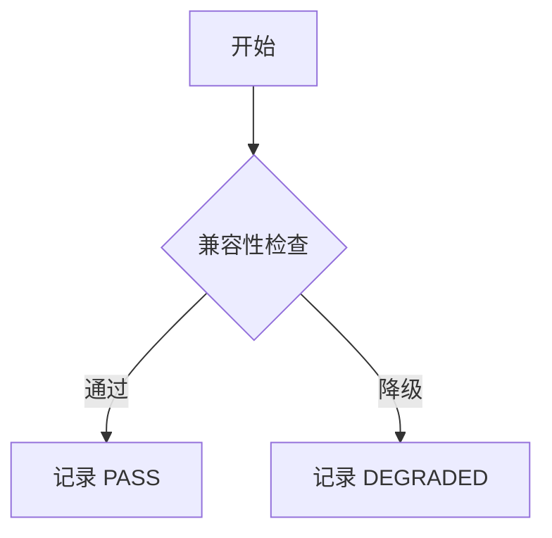
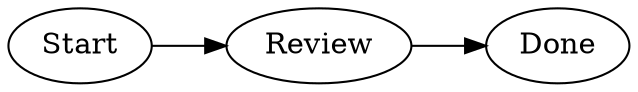
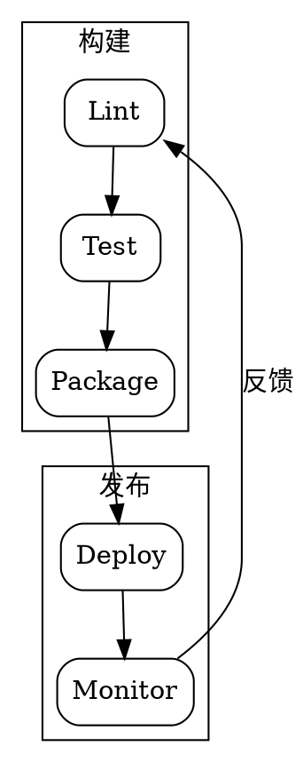

# GitHub Markdown 兼容性测试文档

> 这是一份用于 Chrome 和 VS Code 预览验收的 README 综合样例。文档中的资源地址和 HTML 结构都来自常见的 GitHub README 写法。

[跳到表格](#html-table) · [跳到内部锚点](#internal-anchor) · [打开相对 Markdown 链接](./docs/guide.md)

## 基础 Markdown

这是普通段落，包含 **粗体**、*斜体*、~~删除线~~、`行内代码` 和一个[外部链接](https://github.com/JQQQQQQQ/feishu-md-viewer)。

- 无序列表
- 第二项

1. 有序列表
2. 第二项

- [ ] 未完成任务
- [x] 已完成任务

> 这是一个普通引用。

```typescript
const message = 'GitHub README';
console.log(message);
```

## 图片、徽章和贡献者

普通相对图片：


图片使用懒加载属性：


徽章和外链图片：

[](https://github.com/JQQQQQQQ/feishu-md-viewer/actions)


[](https://github.com/JQQQQQQQ/feishu-md-viewer/graphs/contributors)

## 响应式图片和快捷键

<picture>
  <source media="(prefers-color-scheme: dark)" srcset="https://raw.githubusercontent.com/github/explore/main/topics/markdown/markdown.png 1x, https://raw.githubusercontent.com/github/explore/main/topics/markdown/markdown.png 2x" />
  <source media="(prefers-color-scheme: light)" srcset="./assets/light-demo.png" />
  
</picture>

使用 <kbd>Ctrl</kbd> + <kbd>F</kbd> 搜索文档，使用 <kbd>Esc</kbd> 关闭弹窗。

## 折叠块和视频

<details open>
  <summary>展开说明</summary>

这是 `<details>` 中的 README 内容，可以包含列表和 `代码`。

- 折叠内容一
- 折叠内容二
</details>

<details>
  <summary>默认收起的说明</summary>
  默认内容应该在点击 summary 后显示。
</details>

<video controls preload="metadata" poster="./assets/video-poster.png" width="640" height="360">
  <source src="./assets/demo.mp4" type="video/mp4" />
  当前环境不支持视频播放，请下载视频文件查看。
</video>

## GFM 表格

| 功能 | Chrome | VS Code |
| --- | --- | --- |
| 任务列表 | 支持 | 支持 |
| 相对资源 | 待验收 | 待验收 |
| Mermaid | 支持 | 支持 |

## HTML Table

<table>
  <thead>
    <tr><th>项目</th><th>状态</th><th>备注</th></tr>
  </thead>
  <tbody>
    <tr><td>HTML 表格</td><td>测试中</td><td>应复用现有表格体验</td></tr>
    <tr><td>表头</td><td>保留</td><td>粘贴到 Excel 时识别</td></tr>
  </tbody>
</table>

## 内嵌布局与链接

<div align="center">
  <strong>居中的 README 区域</strong>
</div>

<div class="demo-row">
  <span>布局块 A</span>
  <span>布局块 B</span>
</div>

<h2 id="internal-anchor">内部锚点目标</h2>

- [返回 HTML 表格](#html-table)
- [相对 Markdown 文档](./docs/guide.md)
- [下载资源](./assets/demo.zip)
- [外部网页](https://github.com/JQQQQQQQ/feishu-md-viewer)

## Mermaid 图表



```mermaid
this is not valid mermaid syntax !!!
```

## 超长内容

下面的重复内容用于验证长 README 的滚动、目录定位和图片懒加载，不代表产品需要为每个段落增加特殊处理。

### 长内容段落一

兼容性矩阵要求每个结构都有明确的处理结果。资源解析必须区分图片、普通链接、下载链接和当前文档锚点。安全过滤发生在 React 元素创建之前，资源重写不能绕过协议校验。

### 长内容段落二

Chrome 本地文件和 VS Code Webview 的资源基准不同，但共享 Markdown 管线应当得到一致的相对路径语义。GitHub blob 页面使用 blob 链接作为普通链接基准，图片和视频使用 raw 链接作为资源基准。

### 长内容段落三

GitLab 的 blob 页面也遵循相同的规则：普通文档链接指向项目文件页面，图片和媒体资源指向 raw 文件地址。无法解析或不安全的地址必须降级，而不是阻塞整份文档。

### 长内容段落四

阅读体验应当保持稳定：目录折叠不影响正文居中，表格仍然使用原生滚动视口，搜索和内部锚点定位不能破坏已有的选择、复制和列宽逻辑。

## DOT / Graphviz 图表

下面三段分别覆盖基础 DOT、复杂 Graphviz 子图和错误降级。





```gv
digraph Broken {
  A -> ;
}
```
