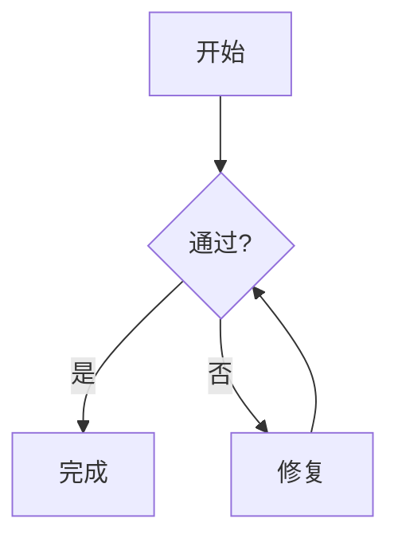

# 发布验收 Fixture

这是用于浏览器发布验收的本地 Markdown 文档，包含常见预览块。

## 目录目标标题

正文包含 **粗体**、*斜体*、~~删除线~~、[链接](https://example.com) 和 `内联代码`。

### 列表与任务

- 无序列表
- 第二项

1. 有序列表
2. 第二项

- [x] 已完成任务
- [ ] 待完成任务

## 引用与 Callout

> 这是一个普通引用。

> [!NOTE]
> 这是一个提示 Callout。

## 代码块

```typescript
export function releaseCheck(): boolean {
  return true;
}
```

## 图片


## 普通表格

| 项目 | 状态 | 负责人 |
| --- | --- | --- |
| 构建 | 通过 | 发布机器人 |
| 预览 | 通过 | QA |

## 宽表格

| 列 1 | 列 2 | 列 3 | 列 4 | 列 5 | 列 6 | 列 7 | 列 8 | 列 9 |
| --- | --- | --- | --- | --- | --- | --- | --- | --- |
| A | B | C | D | E | F | G | H | I |
| 1 | 2 | 3 | 4 | 5 | 6 | 7 | 8 | 9 |

## 有效 Mermaid



## 无效 Mermaid

```mermaid
this is not valid mermaid syntax !!!
```

## 页面滚动内容

为了覆盖滚动和标题定位，这里保留一段较长的验收说明。发布前需要确认页面滚动、目录定位、表格横向滚动和 Mermaid 预览彼此独立，不会因为某个区块的布局变化而把正文重置到顶部。

重复内容：发布质量门禁应当能够稳定地发现资源缺失、跨端 API 串包、错误图降级和本地文件更新等问题。
